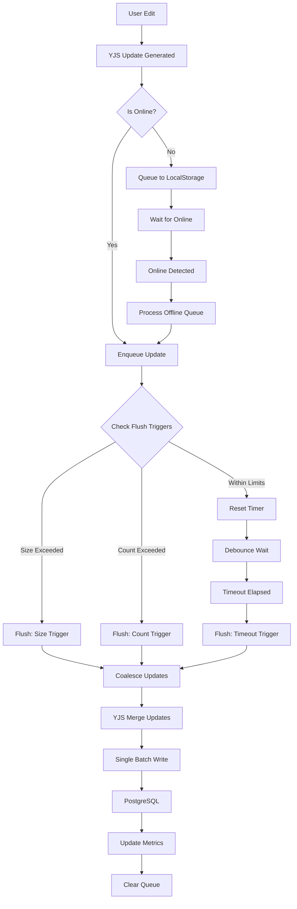
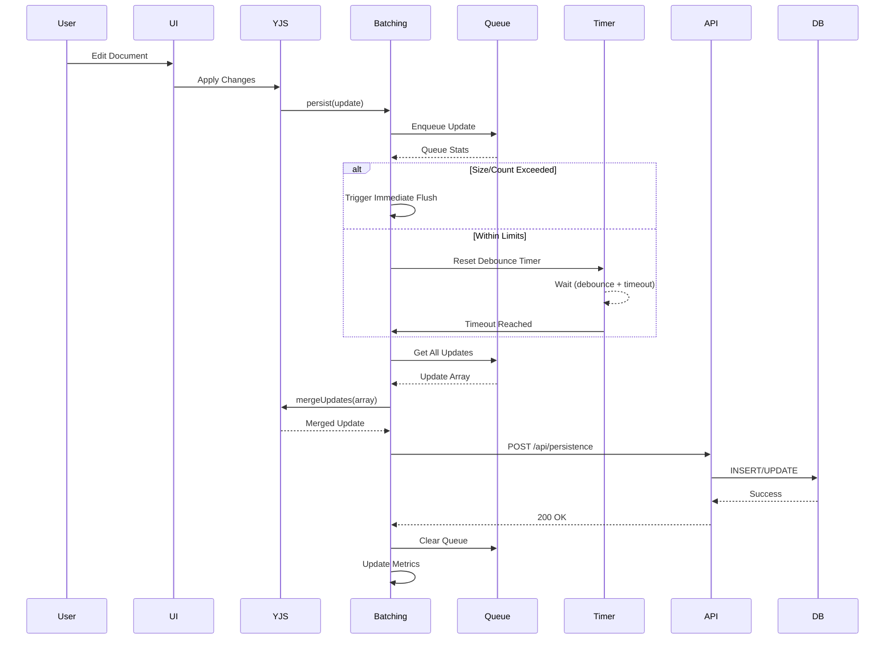
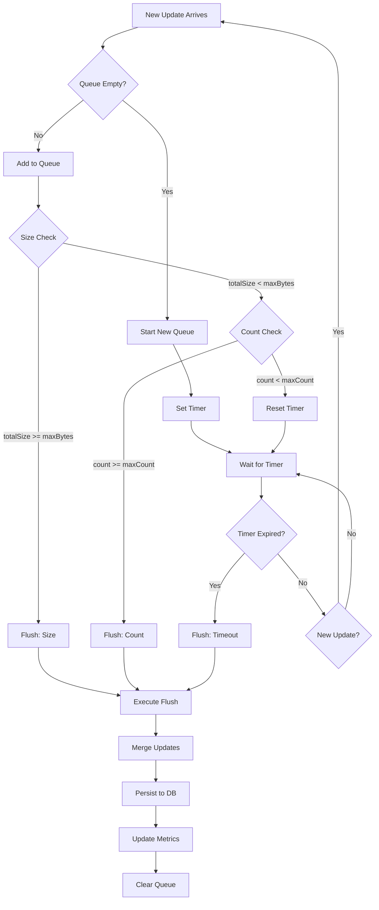
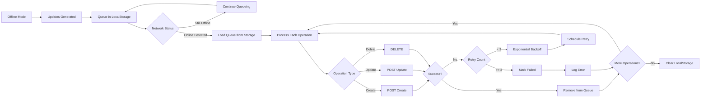
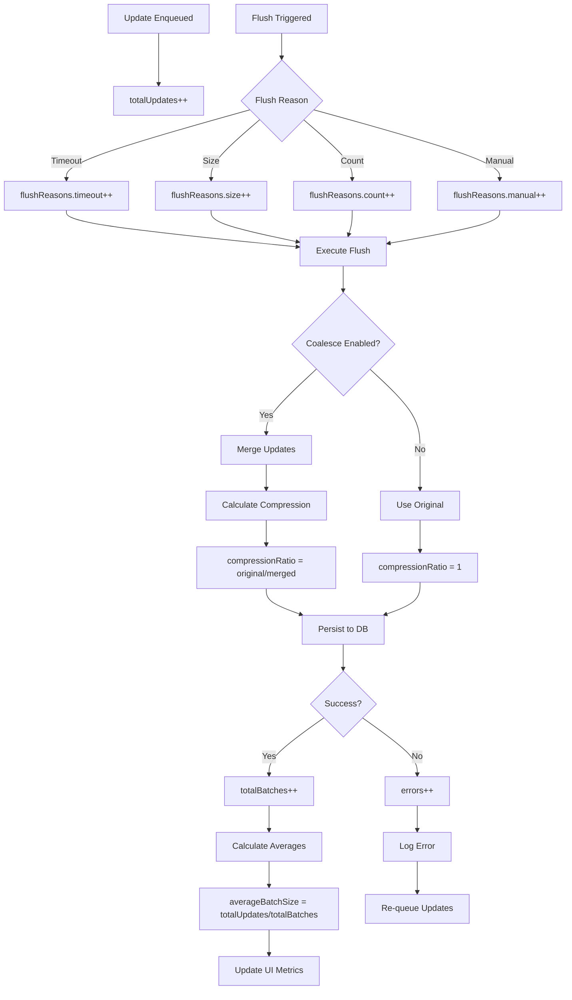
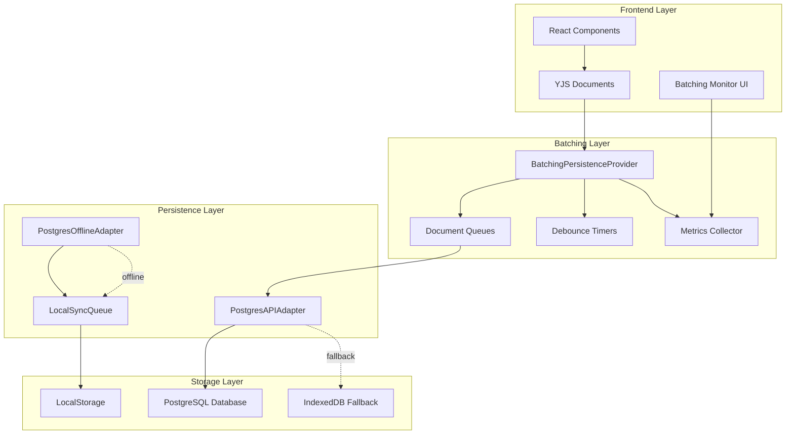
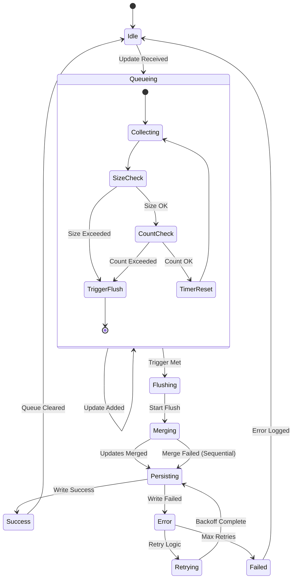
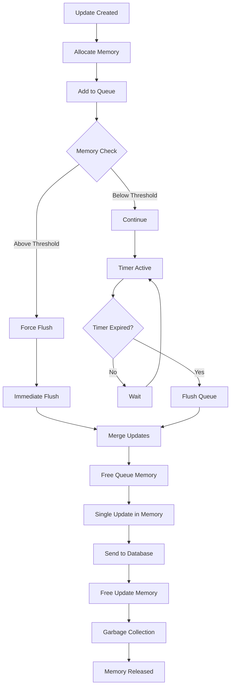

# Batching Method Flow Diagrams

## Main Batching Flow



## Detailed Update Processing



## Flush Decision Tree



## Offline Synchronization Flow



## Metrics Collection Flow



## Component Architecture



## Performance Impact Visualization

```
Before Batching:
Time: 0s   1s   2s   3s   4s   5s
Writes: |W|W|W|W|W|W|W|W|W|W|W|W|W|W|W|
DB Load: ████████████████████████████████
Network: ↑↑↑↑↑↑↑↑↑↑↑↑↑↑↑↑↑↑↑↑↑↑↑↑↑↑↑↑

After Batching:
Time: 0s   1s   2s   3s   4s   5s
Writes: |     B     |     B     |
DB Load: ██          ██
Network: ↑           ↑

Legend:
W = Individual Write
B = Batched Write
█ = Database Load
↑ = Network Request
```

## State Machine Diagram



## Memory Management Flow

