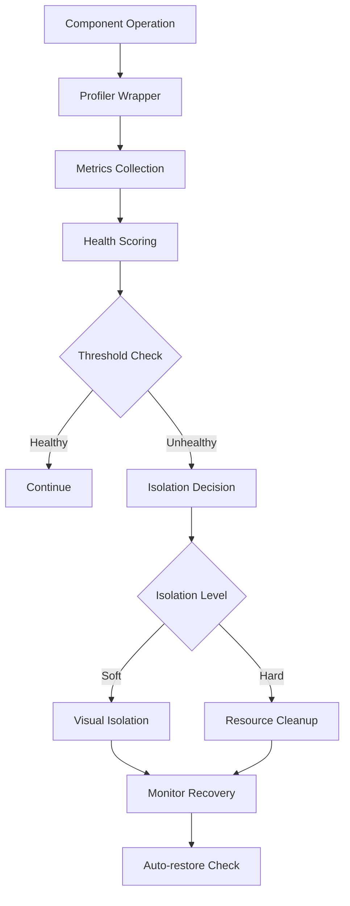

# Isolation Control System - Implementation Plan

## Executive Summary

This document outlines a comprehensive implementation plan for adding an intelligent isolation control system to the annotation canvas. The system will automatically detect and isolate unresponsive or resource-heavy components to maintain canvas performance and stability.

## Table of Contents

1. [Overview](#overview)
2. [Architecture Design](#architecture-design)
3. [Core Components](#core-components)
4. [Implementation Phases](#implementation-phases)
5. [Integration Points](#integration-points)
6. [Testing Strategy](#testing-strategy)
7. [Performance Metrics](#performance-metrics)
8. [Risk Mitigation](#risk-mitigation)

---

## Overview

### Purpose
The Isolation Control System prevents individual components (panels, calculators, timers, editors) from degrading the overall canvas performance by intelligently isolating problematic components while preserving critical functionality.

### Key Features
- Automatic detection of unresponsive components
- Multi-level isolation (soft, hard, critical)
- Performance monitoring with attribution
- User-friendly notifications with explanations
- Graceful degradation with security caps
- Protection of critical operations (autosave, data persistence)

### Success Criteria
- Canvas maintains 30+ FPS even with problematic components
- Zero data loss during isolation events
- Clear user feedback on isolation actions
- Fair and accurate component attribution
- Minimal overhead (<2% CPU in monitoring)

---

## Architecture Design

### System Components

```
┌─────────────────────────────────────────────────────────────┐
│                     Canvas Application                        │
├───────────────────────────────────────────────────────────────┤
│                                                               │
│  ┌──────────────────┐  ┌──────────────────┐                 │
│  │  Component        │  │  Isolation        │                 │
│  │  Profiler         │  │  Manager          │                 │
│  │  - Wrap ops       │  │  - Decisions      │                 │
│  │  - Attribution    │  │  - Orchestration  │                 │
│  └────────┬─────────┘  └────────┬──────────┘                 │
│           │                      │                            │
│  ┌────────▼──────────────────────▼──────────┐                │
│  │         Performance Monitor               │                │
│  │  - FPS tracking                          │                │
│  │  - Resource tracking                     │                │
│  │  - Health scoring                        │                │
│  └────────┬──────────────────────────────────┘                │
│           │                                                   │
│  ┌────────▼─────────────────────────────────┐                │
│  │         Isolation Controller              │                │
│  │  - Soft isolation                        │                │
│  │  - Hard isolation                        │                │
│  │  - Resource cleanup                      │                │
│  └──────────────────────────────────────────┘                │
│                                                               │
│  ┌──────────────────────────────────────────┐                │
│  │         Canvas Items                      │                │
│  │  ┌─────────┐ ┌─────────┐ ┌─────────┐    │                │
│  │  │ Panel   │ │Component│ │Component│    │                │
│  │  │ (Note)  │ │(Calc)   │ │(Timer)  │    │                │
│  │  └─────────┘ └─────────┘ └─────────┘    │                │
│  └──────────────────────────────────────────┘                │
└───────────────────────────────────────────────────────────────┘
```

### Data Flow



---

## Core Components

### 1. Component Profiler

**Purpose**: Wrap all component operations for accurate performance attribution.

**Key Features**:
- Async-aware operation wrapping
- Precise timing with `performance.now()`
- Long-task attribution with tolerance
- Error tracking integration

**Interface**:
```typescript
interface ComponentProfiler {
  runWithProfiler<T>(
    componentId: string,
    operation: () => Promise<T> | T
  ): Promise<T>;
  
  getMetrics(componentId: string): ComponentMetrics;
  matchLongTask(entry: PerformanceEntry): string | null;
}
```

### 2. Performance Monitor

**Purpose**: Track global and per-component performance metrics.

**Key Features**:
- RAF-based FPS monitoring
- Resource budget tracking
- EWMA smoothing for stability
- Ring buffer for efficient sampling

**Interface**:
```typescript
interface PerformanceMonitor {
  startMonitoring(): void;
  getGlobalFPS(): number;
  getComponentHealth(id: string): HealthScore;
  setThresholds(config: ThresholdConfig): void;
}
```

### 3. Isolation Manager

**Purpose**: Orchestrate isolation decisions with hysteresis and cooldowns.

**Key Features**:
- Multi-level isolation strategies
- Hysteresis to prevent flapping
- Priority-based decisions
- Security caps (max 3 isolated)

**Interface**:
```typescript
interface IsolationManager {
  evaluateComponent(id: string, metrics: ComponentMetrics): void;
  isolate(id: string, level: IsolationLevel): void;
  restore(id: string): void;
  getIsolatedComponents(): Set<string>;
}
```

### 4. Isolation Controller

**Purpose**: Execute isolation and cleanup operations.

**Key Features**:
- Canvas memory release
- Timer management (preserve critical)
- Network request abortion
- State preservation

**Interface**:
```typescript
interface IsolationController {
  softIsolate(component: IsolationAware): void;
  hardIsolate(component: IsolationAware): void;
  restore(component: IsolationAware): void;
  cleanup(component: IsolationAware): void;
}
```

### 5. Component Adapter

**Purpose**: Make components isolation-aware.

**Interface**:
```typescript
interface IsolationAware {
  // Lifecycle
  onIsolate(level: 'soft' | 'hard'): void;
  onResume(): void;
  
  // Reporting
  reportResources(): ResourceMetrics;
  getPriority(): Priority;
  
  // Rendering
  renderPlaceholder(): ReactNode;
  
  // Cleanup
  abortOperations(): void;
  flushPendingChanges(): Promise<void>;
}
```

---

## Implementation Phases

### Phase 1: Foundation (Week 1)

**Goals**: Set up core monitoring infrastructure

**Tasks**:
1. Create folder structure and base files
2. Implement ComponentProfiler with basic wrapping
3. Add FPS monitor using RAF
4. Create configuration system
5. Add basic metrics collection

**Deliverables**:
- `/lib/isolation/profiler.ts`
- `/lib/isolation/fps-monitor.ts`
- `/lib/isolation/config.ts`
- `/lib/isolation/types.ts`

### Phase 2: Detection (Week 2)

**Goals**: Implement detection and scoring

**Tasks**:
1. Implement health scoring with EWMA
2. Add ring buffer for sampling
3. Create resource tracking
4. Implement threshold checking
5. Add hysteresis logic

**Deliverables**:
- `/lib/isolation/health-scorer.ts`
- `/lib/isolation/resource-tracker.ts`
- `/lib/isolation/ring-buffer.ts`

### Phase 3: Isolation (Week 3)

**Goals**: Implement isolation mechanisms

**Tasks**:
1. Create IsolationManager
2. Implement soft isolation
3. Implement hard isolation
4. Add cleanup routines
5. Create restoration logic

**Deliverables**:
- `/lib/isolation/isolation-manager.ts`
- `/lib/isolation/isolation-controller.ts`
- `/lib/isolation/cleanup.ts`

### Phase 4: Integration (Week 4)

**Goals**: Integrate with canvas components

**Tasks**:
1. Make panels isolation-aware
2. Make components isolation-aware
3. Add UI notifications
4. Integrate with control panel
5. Add visual indicators

**Deliverables**:
- `/components/canvas/isolation-adapter.tsx`
- `/components/canvas/isolation-ui.tsx`
- Updated component files

### Phase 5: Testing & Optimization (Week 5)

**Goals**: Ensure reliability and performance

**Tasks**:
1. Unit tests for all modules
2. Integration tests
3. Performance benchmarking
4. Edge case handling
5. Documentation

**Deliverables**:
- `/tests/isolation/*.test.ts`
- Performance report
- User documentation

---

## Integration Points

### 1. Canvas Components

**File**: `/components/canvas/component-panel.tsx`

```typescript
// Add to ComponentPanel
import { useIsolation } from '@/lib/isolation/hooks';

export function ComponentPanel({ id, type, position, onClose, onPositionChange }: ComponentPanelProps) {
  const { isIsolated, isolationLevel, placeholder } = useIsolation(id);
  
  // Wrap operations
  const handleOperation = useCallback(async () => {
    return profiler.runWithProfiler(id, async () => {
      // Component operation
    });
  }, [id]);
  
  if (isIsolated) {
    return placeholder;
  }
  
  // Regular render
}
```

### 2. Canvas Panel

**File**: `/components/canvas/canvas-panel.tsx`

```typescript
// Add isolation awareness
class CanvasPanel implements IsolationAware {
  getPriority(): Priority {
    return this.panelId === 'main' ? 'critical' : 'normal';
  }
  
  onIsolate(level: 'soft' | 'hard') {
    if (level === 'soft') {
      this.pauseAnimations();
    } else {
      this.cleanup();
    }
  }
  
  async flushPendingChanges() {
    await this.editor?.save();
  }
}
```

### 3. Control Panel

**File**: `/components/canvas/enhanced-control-panel.tsx`

```typescript
// Add isolation controls tab
<Tab label="Isolation" icon={Lock}>
  <IsolationControls
    isolated={isolatedComponents}
    onIsolateUnresponsive={handleIsolateUnresponsive}
    onUnisolateAll={handleUnisolateAll}
    statistics={isolationStats}
  />
</Tab>
```

### 4. Minimap

**File**: `/components/canvas/enhanced-minimap.tsx`

```typescript
// Show isolated components differently
components.forEach(component => {
  if (isolationManager.isIsolated(component.id)) {
    // Render with special style (e.g., grayed out)
    ctx.fillStyle = 'rgba(128, 128, 128, 0.5)';
  }
});
```

---

## Testing Strategy

### Unit Tests

```typescript
// Example test
describe('IsolationManager', () => {
  it('should require consecutive bad windows before isolation', () => {
    const manager = new IsolationManager({ consecutiveThreshold: 3 });
    
    manager.recordBadFrame('comp-1');
    expect(manager.shouldIsolate('comp-1')).toBe(false);
    
    manager.recordBadFrame('comp-1');
    expect(manager.shouldIsolate('comp-1')).toBe(false);
    
    manager.recordBadFrame('comp-1');
    expect(manager.shouldIsolate('comp-1')).toBe(true);
  });
  
  it('should respect cooldown period', () => {
    const manager = new IsolationManager({ cooldownMs: 5000 });
    
    manager.isolate('comp-1');
    manager.recordBadFrame('comp-1');
    
    expect(manager.shouldIsolate('comp-1')).toBe(false);
  });
});
```

### Integration Tests

```typescript
describe('Canvas with Isolation', () => {
  it('should maintain FPS when component is problematic', async () => {
    const canvas = render(<AnnotationCanvas />);
    
    // Add problematic component
    const calculator = await canvas.addComponent('calculator');
    await calculator.simulateHeavyOperation();
    
    // Check that FPS is maintained
    await waitFor(() => {
      expect(canvas.getFPS()).toBeGreaterThan(30);
    });
    
    // Check that component was isolated
    expect(calculator.isIsolated()).toBe(true);
  });
});
```

### Performance Tests

```typescript
describe('Isolation Overhead', () => {
  it('should have minimal monitoring overhead', () => {
    const baseline = measurePerformance(() => {
      // Run without isolation
    });
    
    const withIsolation = measurePerformance(() => {
      // Run with isolation monitoring
    });
    
    const overhead = ((withIsolation - baseline) / baseline) * 100;
    expect(overhead).toBeLessThan(2); // Less than 2% overhead
  });
});
```

---

## Performance Metrics

### Key Performance Indicators

| Metric | Target | Measurement |
|--------|--------|-------------|
| Monitoring Overhead | < 2% CPU | Performance profiling |
| Detection Latency | < 500ms | Time to isolation decision |
| False Positive Rate | < 5% | Isolated healthy components |
| Recovery Time | < 2s | Time to restore after issue resolved |
| Data Loss | 0% | Unsaved changes during isolation |

### Monitoring Dashboard

```typescript
interface IsolationMetrics {
  // Real-time
  currentFPS: number;
  isolatedCount: number;
  activeComponents: number;
  
  // Historical
  isolationEvents: IsolationEvent[];
  averageRecoveryTime: number;
  falsePositiveRate: number;
  
  // Component specific
  componentMetrics: Map<string, {
    avgRenderTime: number;
    isolationCount: number;
    lastIsolated: number;
    healthScore: number;
  }>;
}
```

---

## Risk Mitigation

### Technical Risks

| Risk | Impact | Mitigation |
|------|--------|------------|
| False positives | High | Hysteresis, cooldowns, multi-factor scoring |
| Data loss | Critical | Always preserve autosave, flush before isolate |
| Attribution errors | Medium | Fallback to highest EWMA score |
| Performance overhead | Medium | Ring buffer, periodic evaluation |
| Browser compatibility | Low | Feature detection, graceful degradation |

### Mitigation Strategies

1. **Progressive Enhancement**
   - Start with manual isolation
   - Add automatic detection gradually
   - Allow users to disable auto-isolation

2. **Escape Hatches**
   - Manual override buttons
   - Disable for specific components
   - Global kill switch

3. **User Trust**
   - Clear explanations
   - Undo capabilities
   - Performance improvements visible

---

## Configuration

### Default Configuration

```typescript
export const DEFAULT_ISOLATION_CONFIG: IsolationConfig = {
  // Timing
  timing: {
    evaluationIntervalMs: 250,
    cooldownMs: 5000,
    restoreDelayMs: 2000,
  },
  
  // Thresholds
  thresholds: {
    frameBudgetMs: 16.67, // 60 FPS
    minFPS: 30,
    maxRenderMs: 50,
    consecutiveBadFrames: 3,
    healthScoreThreshold: 3.0,
  },
  
  // Resource Budgets
  budgets: {
    maxEventListeners: 100,
    maxDOMNodes: 1000,
    maxCanvasPixels: 4_000_000,
    maxTimers: 20,
  },
  
  // Isolation
  isolation: {
    maxIsolatedComponents: 3,
    neverIsolate: ['main'],
    priorityOrder: ['low', 'normal', 'high', 'critical'],
    autoRestore: true,
  },
  
  // UI
  ui: {
    showNotifications: true,
    showVisualIndicators: true,
    notificationDurationMs: 5000,
  },
  
  // Performance
  performance: {
    enableProfiling: true,
    sampleSize: 30, // frames
    smoothingFactor: 0.2, // EWMA
  },
};
```

### Device Profiles

```typescript
export const DEVICE_PROFILES = {
  high: {
    thresholds: { ...DEFAULT_ISOLATION_CONFIG.thresholds },
    budgets: { ...DEFAULT_ISOLATION_CONFIG.budgets },
  },
  
  medium: {
    thresholds: {
      frameBudgetMs: 33.33, // 30 FPS
      minFPS: 20,
      maxRenderMs: 100,
      consecutiveBadFrames: 2,
      healthScoreThreshold: 2.0,
    },
    budgets: {
      maxEventListeners: 50,
      maxDOMNodes: 500,
      maxCanvasPixels: 2_000_000,
      maxTimers: 10,
    },
  },
  
  low: {
    thresholds: {
      frameBudgetMs: 50, // 20 FPS
      minFPS: 15,
      maxRenderMs: 150,
      consecutiveBadFrames: 1,
      healthScoreThreshold: 1.5,
    },
    budgets: {
      maxEventListeners: 25,
      maxDOMNodes: 250,
      maxCanvasPixels: 1_000_000,
      maxTimers: 5,
    },
  },
};
```

---

## Next Steps

1. **Review & Approval**: Get stakeholder buy-in on approach
2. **Prototype**: Build minimal POC with one component
3. **Benchmark**: Establish performance baselines
4. **Iterate**: Refine based on real-world testing
5. **Deploy**: Gradual rollout with feature flags

---

## Appendix

### A. File Structure

```
/lib/isolation/
├── index.ts                 # Main exports
├── types.ts                 # TypeScript interfaces
├── config.ts                # Configuration
├── profiler.ts              # Component profiler
├── fps-monitor.ts           # FPS monitoring
├── health-scorer.ts         # Health scoring
├── resource-tracker.ts      # Resource tracking
├── ring-buffer.ts           # Metrics buffer
├── isolation-manager.ts     # Decision orchestration
├── isolation-controller.ts  # Isolation execution
├── cleanup.ts              # Resource cleanup
├── hooks.ts                # React hooks
└── utils.ts                # Utilities

/components/canvas/
├── isolation-adapter.tsx    # Component adapter
├── isolation-ui.tsx        # UI components
└── isolation-controls.tsx  # Control panel tab

/tests/isolation/
├── profiler.test.ts
├── health-scorer.test.ts
├── isolation-manager.test.ts
├── integration.test.ts
└── performance.test.ts
```

### B. Dependencies

- No external dependencies required
- Uses native browser APIs:
  - Performance API
  - RequestAnimationFrame
  - IntersectionObserver (optional)
  - AbortController

### C. Browser Support

- Chrome/Edge: Full support
- Firefox: Full support (except performance.memory)
- Safari: Full support (except performance.memory)
- Fallbacks provided for missing APIs

---

## Conclusion

This isolation control system will significantly improve the stability and performance of the annotation canvas by preventing individual components from degrading the overall user experience. The phased implementation approach ensures we can validate each component before moving forward, while the comprehensive testing strategy ensures reliability.

The system is designed to be transparent to users, with clear explanations when isolation occurs and automatic recovery when possible. By protecting critical operations like autosave and data persistence, we ensure that isolation never results in data loss.

With proper implementation and testing, this system will make the canvas resilient to performance issues while maintaining a smooth, responsive user experience.