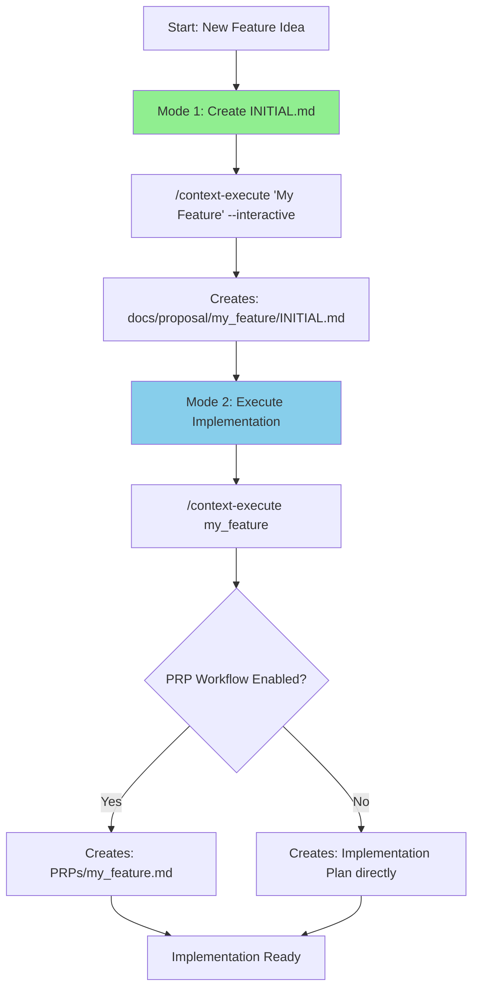

# /context-execute: The Dual-Purpose Command

## ✅ YES - You're Correct!

`/context-execute` serves TWO different purposes depending on the flags:

## 📊 The Two Modes

| Mode | Command | Purpose | Creates | Reads |
|------|---------|---------|---------|-------|
| **Mode 1** | `/context-execute "Feature" --interactive` | Create INITIAL.md | `docs/proposal/feature/INITIAL.md` | Nothing |
| **Mode 2** | `/context-execute feature` | Execute INITIAL.md → PRP | `PRPs/feature.md` (optional) | `docs/proposal/feature/INITIAL.md` |

## 🔄 The Complete Feature Workflow



## 📝 Mode 1: Create INITIAL.md (--interactive flag)

### Purpose
Create the initial feature specification document

### Command
```bash
/context-execute "Your Feature Name" --interactive
```

### What it does
1. Delegates to `init-interactive.js`
2. Creates directory structure
3. Generates INITIAL.md with all required sections
4. Validates the document
5. Logs telemetry

### Example
```bash
# Create new feature specification
/context-execute "User Authentication" --interactive

# With options
/context-execute "Dark Mode" --interactive --batch-mode --apply
```

### Output
```
Created: docs/proposal/user_authentication/INITIAL.md
```

## 🚀 Mode 2: Execute INITIAL.md (no --interactive flag)

### Purpose
Read existing INITIAL.md and create implementation plan (PRP if enabled)

### Command
```bash
/context-execute <feature_slug>
```

### What it does
1. Reads `docs/proposal/<feature_slug>/INITIAL.md`
2. If PRP workflow enabled: Creates `PRPs/<feature_slug>.md`
3. If not: Creates implementation plan directly
4. Sets up feature structure
5. Prepares for development

### Example
```bash
# Execute existing feature
/context-execute user_authentication

# With custom plan
/context-execute dark_mode --plan drafts/dark-mode-ideas.md
```

### Output
```
Created: PRPs/user_authentication.md (if PRP enabled)
Or
Created: docs/proposal/user_authentication/implementation.md
```

## 🎯 Complete Example: Both Modes

```bash
# Step 1: CREATE the INITIAL.md (Mode 1)
/context-execute "Shopping Cart Feature" --interactive
# → Creates: docs/proposal/shopping_cart_feature/INITIAL.md

# Step 2: EXECUTE the INITIAL.md (Mode 2)
/context-execute shopping_cart_feature
# → Reads: docs/proposal/shopping_cart_feature/INITIAL.md
# → Creates: PRPs/shopping_cart_feature.md (or implementation plan)
```

## 🔍 How to Tell Which Mode You're In

### Mode 1 (Creating INITIAL.md)
```bash
# Has --interactive flag
/context-execute "Feature Name" --interactive
#                               ^^^^^^^^^^^^^^
```

### Mode 2 (Executing INITIAL.md)
```bash
# No --interactive flag
/context-execute feature_slug
#                ↑ No quotes, just slug
#                ↑ No --interactive flag
```

## ⚙️ Behind the Scenes

### Mode 1 Flow (--interactive)
```javascript
// execute-cli.js detects --interactive
if (input.interactive) {
  // Delegate to init-interactive.js
  spawn('node', ['init-interactive.js', featureSlug]);
}
```

### Mode 2 Flow (no --interactive)
```javascript
// execute-cli.js runs orchestrator
else {
  // Read INITIAL.md
  const initial = readFile(`docs/proposal/${feature}/INITIAL.md`);
  
  // Generate PRP or implementation
  if (PRP_ENABLED) {
    createPRP(initial);
  } else {
    createImplementationPlan(initial);
  }
}
```

## 📋 Quick Reference

### Creating a New Feature
```bash
# Mode 1: Create INITIAL.md
/context-execute "My New Feature" --interactive
```

### Working with Existing Feature
```bash
# Mode 2: Execute INITIAL.md → PRP/Implementation
/context-execute my_new_feature
```

### Full Workflow
```bash
# 1. Create specification
/context-execute "API Gateway" --interactive

# 2. Execute implementation
/context-execute api_gateway

# 3. Result: Both INITIAL.md and PRP/implementation ready
```

## ❓ FAQ

### Q: What if I run Mode 2 without creating INITIAL.md first?
**A:** You'll get an error: "INITIAL.md not found"

### Q: Can I skip Mode 1 and create INITIAL.md manually?
**A:** Yes, but using `--interactive` ensures proper format and validation

### Q: What's the difference between PRP and implementation plan?
**A:** 
- PRP (Pull Request Plan): Detailed plan for PR submission
- Implementation Plan: Direct development plan
- Depends on your team's workflow preference

### Q: Which mode should I use first?
**A:** Always Mode 1 first (create INITIAL.md), then Mode 2 (execute it)

## ✅ Summary

**YES, you understand correctly!**

1. **Mode 1**: `/context-execute "Name" --interactive` → Creates INITIAL.md
2. **Mode 2**: `/context-execute slug` → Executes INITIAL.md → Creates PRP

It's the same command with dual purpose based on the `--interactive` flag!