# Directory Structure Clarification: Drafts vs Docs/Proposal

## 🗂️ Understanding the Directory Structure

### The Two Key Directories

```
annotation-backup/
├── context-os/
│   └── drafts/              # OPTIONAL: Rough ideas, sketches
│       └── my-idea.md       # Informal planning notes
│
└── docs/proposal/           # OFFICIAL: All features live here
    └── my_feature/          # Created by /context-execute
        └── INITIAL.md       # The official feature spec
```

## 📍 Where INITIAL.md Should Go

**Answer: INITIAL.md is AUTOMATICALLY created in `docs/proposal/<feature_slug>/`**

You DON'T need to manually place it anywhere before running the command!

## 🔄 The Correct Workflow

### Option 1: Direct Creation (Recommended)
```bash
# Just run this command - it creates everything for you!
/context-execute "My Feature" --interactive

# This AUTOMATICALLY creates:
# → docs/proposal/my_feature/INITIAL.md
```

### Option 2: With Draft Plan (Optional)
```bash
# 1. If you have a rough idea, save it in drafts (OPTIONAL)
echo "My rough ideas..." > context-os/drafts/my-feature-draft.md

# 2. Reference it when creating
/context-execute "My Feature" --interactive --plan context-os/drafts/my-feature-draft.md

# This still creates:
# → docs/proposal/my_feature/INITIAL.md
```

## ❌ Common Misconceptions

### WRONG Understanding:
```
"I need to create INITIAL.md somewhere first, 
then run /context-execute"
```

### ✅ CORRECT Understanding:
```
"/context-execute --interactive CREATES the INITIAL.md for me
in the correct location automatically"
```

## 📁 Directory Purposes Explained

### `context-os/drafts/`
- **Purpose**: Rough ideas, brainstorming, sketches
- **Optional**: You don't need to use this at all
- **Informal**: Not validated, just notes
- **Examples**:
  ```
  context-os/drafts/
  ├── dark-mode.md         # Rough idea for dark mode
  ├── auth-ideas.md        # Brainstorming auth system
  └── payment-sketch.md    # Quick notes about payments
  ```

### `docs/proposal/<feature>/`
- **Purpose**: Official feature documentation
- **Required**: All features must be here
- **Structured**: Follows strict format
- **Created by**: `/context-execute` or `/context-init`
- **Examples**:
  ```
  docs/proposal/
  ├── dark_mode/
  │   └── INITIAL.md       # Official dark mode spec
  ├── auth_system/
  │   └── INITIAL.md       # Official auth spec
  └── payment_gateway/
      └── INITIAL.md       # Official payment spec
  ```

## 🎯 The Complete Flow

```mermaid
graph TD
    A[Start: Want new feature] --> B{Have rough ideas?}
    
    B -->|No| C[Run /context-execute --interactive]
    B -->|Yes| D[Optional: Save draft]
    
    D --> E[context-os/drafts/my-idea.md]
    E --> F[Run /context-execute --interactive --plan drafts/my-idea.md]
    
    C --> G[System creates docs/proposal/feature/INITIAL.md]
    F --> G
    
    G --> H[✅ INITIAL.md created automatically]
    
    style G fill:#90EE90
    style H fill:#90EE90
```



## 💡 Key Points to Remember

1. **You DON'T create INITIAL.md manually**
   - The system creates it for you
   - In the correct location
   - With the correct format

2. **Drafts are OPTIONAL**
   - Just rough notes
   - Not required at all
   - Can be referenced with --plan flag

3. **The command does ALL the work**
   ```bash
   /context-execute "My Feature" --interactive
   ```
   This single command:
   - ✅ Creates the directory structure
   - ✅ Creates INITIAL.md
   - ✅ Validates the content
   - ✅ Logs telemetry

## 🚀 Quick Start Examples

### Example 1: Simple Feature (No Draft)
```bash
# Just run this - nothing else needed!
/context-execute "User Authentication" --interactive

# Creates: docs/proposal/user_authentication/INITIAL.md
```

### Example 2: Feature with Draft Ideas
```bash
# Step 1: Save your rough ideas (optional)
cat > context-os/drafts/auth-ideas.md << EOF
- Need OAuth support
- Should handle 2FA
- Must be secure
EOF

# Step 2: Create the official feature
/context-execute "User Authentication" --interactive --plan context-os/drafts/auth-ideas.md

# Creates: docs/proposal/user_authentication/INITIAL.md
# (The draft is incorporated but the INITIAL.md is still created automatically)
```

### Example 3: Batch Mode (CI/CD)
```bash
# No prompts, fully automated
/context-execute "API Gateway" --interactive --batch-mode --apply

# Creates: docs/proposal/api_gateway/INITIAL.md
```

## ❓ FAQ

### Q: Do I need to create any directories first?
**A: No!** The command creates everything.

### Q: Where do I put my INITIAL.md before running the command?
**A: Nowhere!** The command creates INITIAL.md for you.

### Q: What if I already have ideas written down?
**A: Save them in `context-os/drafts/` and use `--plan` flag (optional).**

### Q: What's the difference between drafts and docs/proposal?
**A:**
- `drafts/` = Informal notes (optional)
- `docs/proposal/` = Official features (created automatically)

### Q: Can I skip drafts entirely?
**A: Yes!** Most users never use drafts at all.

## ✅ Summary

**Just run the command and let it do everything:**
```bash
/context-execute "Your Feature Name" --interactive
```

The system will:
1. Create `docs/proposal/your_feature_name/` directory
2. Create `INITIAL.md` inside it
3. Validate everything
4. You're done!

**You don't need to prepare anything beforehand!**