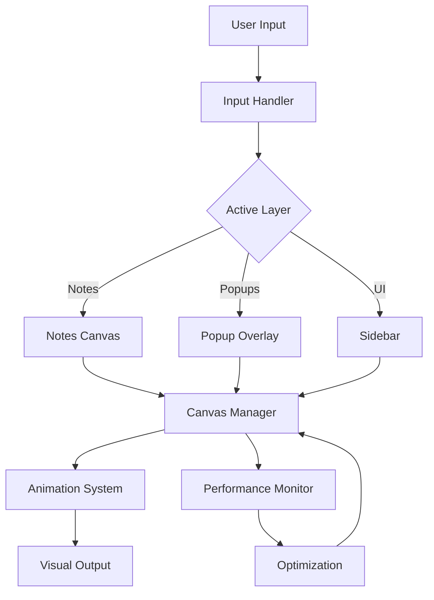

# Multi-Layer Canvas Technical Architecture

## System Components

### Design Tokens
```typescript
// lib/constants/z-index.ts
export const Z_INDEX = {
  NOTES_CANVAS: 1,
  POPUP_OVERLAY: 100, // Below header/toolbars
  SIDEBAR: 1000,
  TOAST: 2000,
} as const
```

### 1. Layer Provider
React context that manages layer state and active layer.

```typescript
type LayerTransforms = Record<LayerId, Transform>

interface LayerContextValue {
  activeLayer: LayerId
  transforms: LayerTransforms
  setActiveLayer: (id: LayerId) => void
  updateTransform: (id: LayerId, t: Partial<Transform>) => void
}

const LayerContext = createContext<LayerContextValue | null>(null)

export const LayerProvider: React.FC<{ children: React.ReactNode }> = ({ children }) => {
  const [activeLayer, setActiveLayer] = useState<LayerId>('notes')
  const [transforms, setTransforms] = useState<LayerTransforms>({
    sidebar: { x: 0, y: 0, scale: 1 },
    notes: { x: 0, y: 0, scale: 1 },
    popups: { x: 0, y: 0, scale: 1 },
  })

  const updateTransform = (id: LayerId, t: Partial<Transform>) =>
    setTransforms(prev => ({ ...prev, [id]: { ...prev[id], ...t } }))

  return (
    <LayerContext.Provider value={{ activeLayer, transforms, setActiveLayer, updateTransform }}>
      {children}
    </LayerContext.Provider>
  )
}

export const useLayer = () => {
  const ctx = useContext(LayerContext)
  if (!ctx) throw new Error('useLayer must be used within LayerProvider')
  return ctx
}
```

### 2. React-Based Layer Component
React component approach instead of direct DOM manipulation.

```typescript
// FIXED: React-first design pattern
interface LayerProps {
  id: LayerId
  config: LayerConfig
  transform: Transform
  isActive: boolean
  children: React.ReactNode
}

const Layer: React.FC<LayerProps> = ({ 
  id, 
  config, 
  transform, 
  isActive,
  children 
}) => {
  const [opacity, setOpacity] = useState(isActive ? 1 : 0.6)
  const layerRef = useRef<HTMLDivElement>(null)
  
  // Handle fade transitions with React state
  useEffect(() => {
    setOpacity(isActive ? 1 : 0.6)
  }, [isActive])
  
  // Calculate transform based on single approach (container translate; inner scales)
  const getTransformStyle = () => {
    if (config.fixed) return {}
    
    // Position-only transform (scale applied to children)
    return {
      transform: `translate(${transform.x}px, ${transform.y}px)`,
      transition: 'transform 0.1s ease-out'
    }
  }
  
  return (
    <div
      ref={layerRef}
      data-layer-id={id}
      className={`layer layer-${id}`}
      style={{
        position: config.fixed ? 'fixed' : 'absolute',
        zIndex: config.zIndex,
        opacity,
        transition: 'opacity 0.3s ease',
        pointerEvents: isActive ? 'auto' : 'none',
        ...getTransformStyle()
      }}
    >
      {/* Children handle their own scaling if needed */}
      <div 
        className="layer-content"
        style={{
        transform: config.zoomable ? `scale(${transform.scale})` : undefined,
        transformOrigin: 'top left'
      }}
    >
      {children}
    </div>
  </div>
)
}

// Layer manager using React context
const LayerContext = React.createContext<{
  layers: Map<LayerId, LayerState>
  activeLayer: LayerId
  updateTransform: (id: LayerId, transform: Partial<Transform>) => void
  switchLayer: (id: LayerId) => void
}>()

export const useLayer = () => {
  const context = useContext(LayerContext)
  if (!context) throw new Error('useLayer must be used within LayerProvider')
  return context
}
```

### 3. PopupOverlay (React)
Specific implementation for the popup overlay layer using a React component.

```typescript
const PopupOverlay: React.FC<{ popups: Map<string, PopupData> }> = ({ popups }) => {
  const { transforms, activeLayer, setActiveLayer } = useLayer()
  const transform = transforms.popups

  useEffect(() => {
    if (popups.size === 1 && activeLayer === 'notes') setActiveLayer('popups')
    if (popups.size === 0 && activeLayer === 'popups') setActiveLayer('notes')
  }, [popups.size, activeLayer])

  return (
    <div
      id="popup-overlay"
      className="fixed inset-0 pointer-events-none"
      style={{ zIndex: Z_INDEX.POPUP_OVERLAY, ...CoordinateBridge.containerTransformStyle(transform) }}
    >
      {/* Connection lines (canvas coords; container scales) */}
      <svg className="absolute inset-0 pointer-events-none">
        {ConnectionLineAdapter.adaptConnectionLines(popups, false).map((p, i) => (
          <path key={i} d={p.d} stroke={p.stroke} strokeWidth={p.strokeWidth} opacity={p.opacity} fill="none" />
        ))}
      </svg>

      {/* Popups (canvas coords; enable interaction per node) */}
      {Array.from(popups.values()).map((popup) => (
        <div
          key={popup.id}
          className="absolute pointer-events-auto bg-gray-800 border border-gray-700 rounded-lg shadow-xl"
          style={{ left: `${popup.canvasPosition.x}px`, top: `${popup.canvasPosition.y}px` }}
        >
          {/* popup content */}
        </div>
      ))}
    </div>
  )
}
```

### 4. Input Handler
Manages all user inputs and delegates to appropriate layers.

```typescript
class InputHandler {
  private canvasManager: CanvasManager
  private isDragging: boolean = false
  private dragStart: Point = { x: 0, y: 0 }
  private activeModifiers: Set<string> = new Set()
  
  constructor(canvasManager: CanvasManager) {
    this.canvasManager = canvasManager
    this.setupEventListeners()
    this.setupKeyboardShortcuts()
  }
  
  private setupEventListeners() {
    // Mouse events
    document.addEventListener('mousedown', this.handleMouseDown.bind(this))
    document.addEventListener('mousemove', this.handleMouseMove.bind(this))
    document.addEventListener('mouseup', this.handleMouseUp.bind(this))
    document.addEventListener('wheel', this.handleWheel.bind(this), { passive: false })
    
    // Keyboard events
    document.addEventListener('keydown', this.handleKeyDown.bind(this))
    document.addEventListener('keyup', this.handleKeyUp.bind(this))
  }
  
  private handleMouseMove(event: MouseEvent) {
    if (!this.isDragging) return
    
    const deltaX = event.clientX - this.dragStart.x
    const deltaY = event.clientY - this.dragStart.y
    
    if (this.activeModifiers.has('Alt')) {
      // Alt + Drag: Pan only popup layer
      this.canvasManager.panLayer('popups', deltaX, deltaY)
    } else if (this.activeModifiers.has('Space')) {
      // Space + Drag: Pan active layer
      this.canvasManager.panActiveLayer(deltaX, deltaY)
    } else if (event.buttons === 4) {
      // Middle mouse: Pan both layers
      this.canvasManager.panAllLayers(deltaX, deltaY)
    }
    
    this.dragStart = { x: event.clientX, y: event.clientY }
  }
  
  private setupKeyboardShortcuts() {
    const shortcuts: Record<string, () => void> = {
      'Tab': () => this.canvasManager.toggleLayer(),
      'Escape': () => this.canvasManager.switchLayer('notes'),
      'Cmd+1': () => this.canvasManager.switchLayer('notes'),
      'Cmd+2': () => this.canvasManager.switchLayer('popups'),
      'Cmd+B': () => this.canvasManager.toggleSidebar(),
      'Cmd+0': () => this.canvasManager.resetView()
    }
    
    // Register shortcuts
    Object.entries(shortcuts).forEach(([key, handler]) => {
      this.registerShortcut(key, handler)
    })
  }
}
```

### 5. Animation System
Handles all visual transitions and effects.

```typescript
class AnimationSystem {
  private animations: Map<string, Animation> = new Map()
  
  fadeTransition(element: HTMLElement, from: number, to: number, duration: number = 300) {
    const animation = element.animate([
      { opacity: from },
      { opacity: to }
    ], {
      duration,
      easing: 'ease-in-out',
      fill: 'forwards'
    })
    
    this.animations.set(element.id, animation)
    return animation.finished
  }
  
  slideTransition(element: HTMLElement, fromY: number, toY: number, duration: number = 300) {
    return element.animate([
      { transform: `translateY(${fromY}px)` },
      { transform: `translateY(${toY}px)` }
    ], {
      duration,
      easing: 'ease-out'
    }).finished
  }
  
  async showToast(message: string, duration: number = 2000) {
    const toast = document.createElement('div')
    toast.className = 'toast-notification'
    toast.textContent = message
    document.body.appendChild(toast)
    
    // Slide in
    await this.slideTransition(toast, 20, 0, 300)
    await this.fadeTransition(toast, 0, 1, 300)
    
    // Wait
    await new Promise(resolve => setTimeout(resolve, duration))
    
    // Slide out
    await this.fadeTransition(toast, 1, 0, 300)
    await this.slideTransition(toast, 0, 20, 300)
    
    toast.remove()
  }
  
  springAnimation(element: HTMLElement, property: string, from: number, to: number) {
    // Spring physics animation
    const spring = {
      stiffness: 300,
      damping: 30,
      mass: 1
    }
    
    let velocity = 0
    let position = from
    const target = to
    
    const animate = () => {
      const force = -spring.stiffness * (position - target)
      const damping = -spring.damping * velocity
      const acceleration = (force + damping) / spring.mass
      
      velocity += acceleration * 0.016 // 60fps
      position += velocity * 0.016
      
      element.style[property] = `${position}px`
      
      if (Math.abs(velocity) > 0.01 || Math.abs(position - target) > 0.01) {
        requestAnimationFrame(animate)
      }
    }
    
    requestAnimationFrame(animate)
  }
}
```

### 6. Performance Monitor
Tracks and optimizes rendering performance.

```typescript
class PerformanceMonitor {
  private frameTime: number[] = []
  private maxFrames: number = 60
  
  measureFrame(callback: () => void) {
    const start = performance.now()
    callback()
    const end = performance.now()
    
    this.frameTime.push(end - start)
    if (this.frameTime.length > this.maxFrames) {
      this.frameTime.shift()
    }
    
    this.checkPerformance()
  }
  
  private checkPerformance() {
    const avgFrameTime = this.frameTime.reduce((a, b) => a + b, 0) / this.frameTime.length
    
    if (avgFrameTime > 16.67) { // Below 60fps
      this.optimizeRendering()
    }
  }
  
  private optimizeRendering() {
    // Reduce quality for better performance
    canvasManager.setRenderQuality('low')
    
    // Enable viewport culling
    canvasManager.enableViewportCulling(true)
    
    // Throttle animations
    animationSystem.setThrottle(true)
  }
  
  getStats() {
    const avgFrameTime = this.frameTime.reduce((a, b) => a + b, 0) / this.frameTime.length
    const fps = 1000 / avgFrameTime
    
    return {
      fps: Math.round(fps),
      frameTime: avgFrameTime.toFixed(2),
      isOptimized: avgFrameTime > 16.67
    }
  }
}
```

## Data Flow



## State Management

```typescript
interface GlobalState {
  canvas: {
    activeLayer: LayerId
    layers: Map<LayerId, LayerState>
    syncSettings: {
      pan: boolean
      zoom: boolean
    }
  }
  popups: {
    instances: Map<string, PopupState>
    connections: ConnectionState[]
  }
  notes: {
    panels: Map<string, NotePanel>
    annotations: Map<string, Annotation>
  }
  ui: {
    sidebarVisible: boolean
    theme: 'light' | 'dark'
    shortcuts: ShortcutMap
  }
}
```

## Event System

```typescript
interface LayerEvents {
  'layer-switched': { from: LayerId, to: LayerId }
  'popup-added': { id: string, position: Point }
  'popup-removed': { id: string }
  'pan-started': { layer: LayerId }
  'pan-ended': { layer: LayerId, delta: Point }
  'zoom-changed': { layer: LayerId, scale: number }
  'auto-switch': { reason: string, target: LayerId }
}
```

## Testing Utilities

```typescript
class LayerTestUtils {
  static simulateLayerSwitch(from: LayerId, to: LayerId) {
    const event = new CustomEvent('layer-switch', {
      detail: { from, to }
    })
    document.dispatchEvent(event)
  }
  
  static async waitForAnimation() {
    return new Promise(resolve => {
      requestAnimationFrame(() => {
        requestAnimationFrame(resolve)
      })
    })
  }
  
  static mockPopupCreation(count: number) {
    const popups = []
    for (let i = 0; i < count; i++) {
      popups.push({
        id: `popup-${i}`,
        position: { x: i * 100, y: i * 50 }
      })
    }
    return popups
  }
}
```

---

*Document Version: 1.0*  
*Architecture Status: Complete*  
*Ready for Implementation Review*
