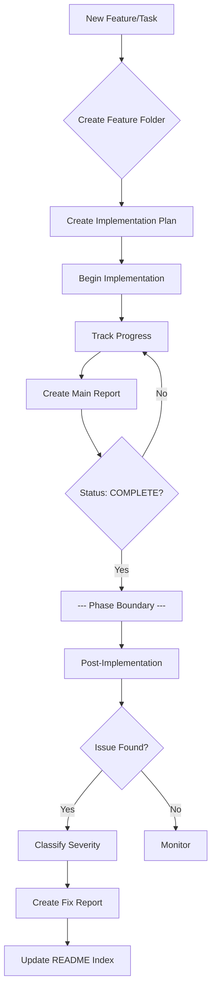
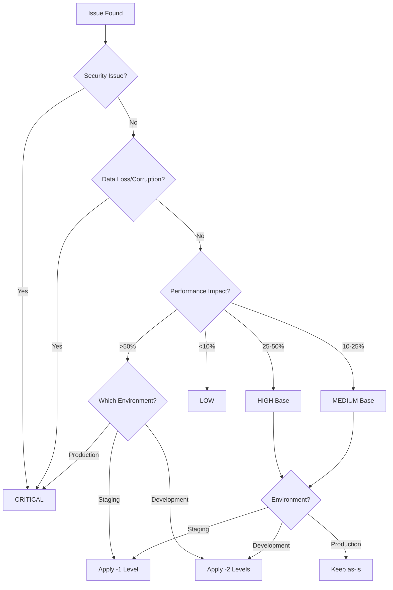
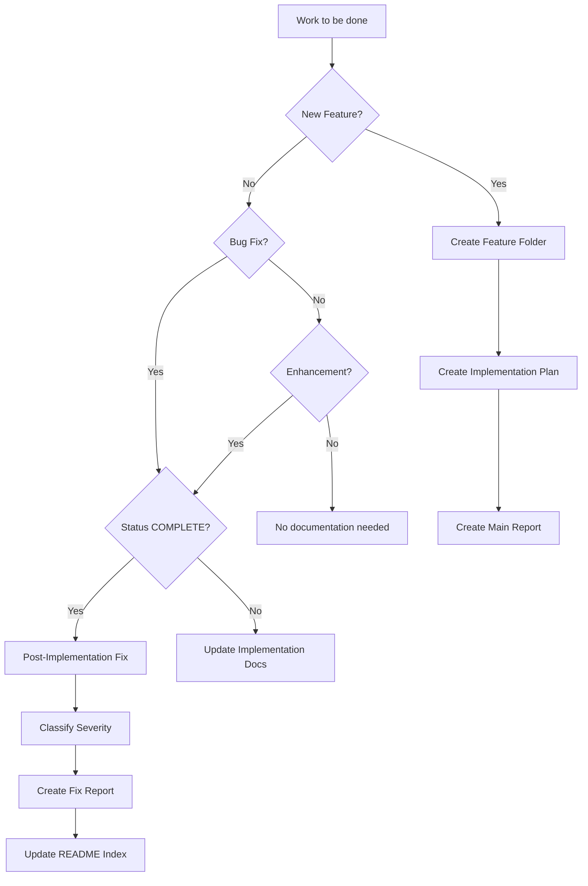
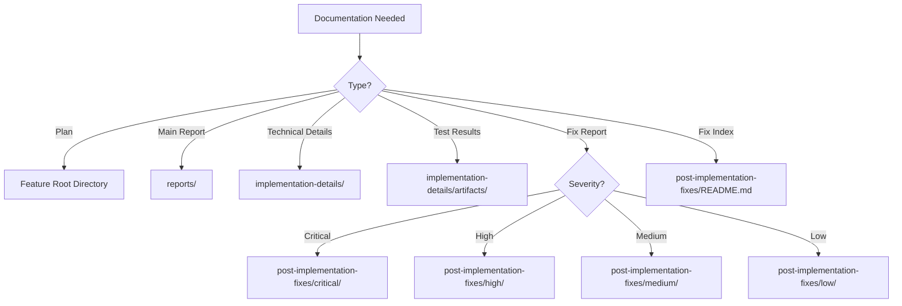

# Comprehensive Workflow Guide for Documentation Process v1.4.2

**Purpose**: Complete step-by-step workflow for using the Documentation Process Guide  
**Created**: 2025-09-02  
**Guide Version**: Based on DOCUMENTATION_PROCESS_GUIDE.md v1.4.2  

## Table of Contents
1. [Overview](#overview)
2. [Documentation Lifecycle](#documentation-lifecycle)
3. [Phase 1: Planning & Setup](#phase-1-planning--setup)
4. [Phase 2: Implementation](#phase-2-implementation)
5. [Phase 3: Post-Implementation](#phase-3-post-implementation)
6. [Severity Classification Workflow](#severity-classification-workflow)
7. [Decision Trees](#decision-trees)
8. [Real-World Examples](#real-world-examples)
9. [Quick Reference](#quick-reference)
10. [Common Scenarios](#common-scenarios)

---

## Overview

The Documentation Process Guide provides a structured approach to documenting all feature implementations and bug fixes. This workflow guide shows exactly how to use it in practice.

### Core Principles
1. **Single Source of Truth**: ACTIVE RULES override everything
2. **Phase Separation**: Clear boundary at Status: COMPLETE
3. **Objective Severity**: Measurable thresholds, not opinions
4. **Navigation Hub Pattern**: Main reports link to details
5. **Mandatory Indexes**: README.md files organize multi-folder structures

### The 5 Active Rules (v1.4.2)
1. **Directory Structure**: Standard folders with severity subfolders
2. **Main Report as TOC**: Links only, no inline code
3. **Post-Implementation Fixes**: After COMPLETE, use severity folders
4. **Inline Content**: None in main report, minimal in fix reports
5. **Severity Classification**: Objective criteria with environment multipliers

---

## Documentation Lifecycle



---

## Phase 1: Planning & Setup

### Step 1.1: Create Feature Workspace
```bash
# Choose a feature slug (lowercase, underscores)
FEATURE_SLUG="interval_free_batch_cleanup"

# Create the directory structure
mkdir -p docs/proposal/$FEATURE_SLUG/{reports,implementation-details/artifacts,post-implementation-fixes/{critical,high,medium,low},patches,test_scripts,test_pages}
```

### Step 1.2: Create Implementation Plan
**File**: `docs/proposal/<feature_slug>/Implementation-Plan.md` or `INITIAL.md`

```markdown
# [Feature Name] Implementation Plan

**Feature Slug**: interval_free_batch_cleanup
**Date**: YYYY-MM-DD
**Status**: 📝 PLANNED

## Objective
[What we're trying to achieve]

## Acceptance Criteria
- [ ] Criterion 1
- [ ] Criterion 2
- [ ] Criterion 3

## Implementation Tasks
1. Task 1
2. Task 2
3. Task 3
```

### Step 1.3: Initialize Tracking
- Use TodoWrite tool to track tasks
- Create feature branch: `feat/interval-free-cleanup`
- Set up initial structure

---

## Phase 2: Implementation

### Step 2.1: During Implementation
Track everything as you work:
- File modifications with line numbers
- Exact error messages encountered
- Decisions and trade-offs
- Test results

### Step 2.2: Create Main Implementation Report
**File**: `reports/<Feature-Name>-Implementation-Report.md`

This is your **navigation hub** - contains ONLY links and summaries:

```markdown
# [Feature Name] Implementation Report

**Implementation Plan**: [Link](../Implementation-Plan.md)
**Date Started**: YYYY-MM-DD
**Date Completed**: YYYY-MM-DD
**Status**: ✅ COMPLETE  <!-- CRITICAL PHASE MARKER -->

## Executive Summary
[2-3 sentences maximum. No more.]

## Scope of Implementation
- What Was Planned: [bullet points]
- What Was Delivered: [checkmarks]

## Quick Status
✅ Delivered on time
✅ All tests passing  
✅ Performance targets met

## Key Metrics
| Metric | Before | After | Improvement |
|--------|--------|-------|-------------|
| CPU Usage | 147% | 0.1% | 99.9% |

## Documentation Index

### 📋 Implementation Details
- [Feature Implementation](../implementation-details/feature.md)
- [Architecture Decisions](../implementation-details/architecture.md)

### 🧪 Testing & Validation  
✅ All tests passing
[→ Full test results](../implementation-details/artifacts/test-results.md)

### 📝 Code Changes
**Files Modified**: 5  
**Lines Changed**: ~150  
[→ File list](../implementation-details/files-modified.md)  
[→ Diffs](../implementation-details/artifacts/diffs.md)

## Acceptance Criteria ✓
✅ Criteria 1 met
✅ Criteria 2 met
✅ Criteria 3 met

---
<!-- PHASE BOUNDARY: Everything above = implementation, below = post-implementation -->

## Post-Implementation Fixes
[→ View all fixes and statistics](../post-implementation-fixes/README.md)
```

### Step 2.3: Document Implementation Details
**Location**: `implementation-details/`

This is where ALL the actual content goes:
- Technical documentation
- Code snippets
- Command outputs
- Test results
- File lists
- Diffs

### Step 2.4: The Critical Moment - Status: COMPLETE

⚠️ **CRITICAL DECISION POINT** ⚠️

When you set `Status: ✅ COMPLETE`:
1. Implementation phase ENDS
2. Cannot go back to IN PROGRESS
3. All future changes go to post-implementation-fixes/
4. Main report becomes read-only (except adding fix links)

---

## Phase 3: Post-Implementation

### Step 3.1: Issue Discovery
After Status: COMPLETE, when you find an issue:

1. **DON'T** modify implementation-details/
2. **DON'T** change Status back
3. **DO** create fix documentation

### Step 3.2: Classify Severity

#### Quick Classification Process



#### Severity Levels with Objective Criteria

| Severity | Performance | Memory | Users | Response Time |
|----------|------------|--------|-------|---------------|
| 🔴 **Critical** | >50% degradation | System crash | System down | Immediate |
| 🟠 **High** | 25-50% degradation | >25%/24h growth | >10% affected | <24 hours |
| 🟡 **Medium** | 10-25% degradation | Noticeable growth | 1-10% affected | <1 week |
| 🟢 **Low** | <10% degradation | Minimal | <1% affected | As time permits |

#### Environment Multiplier

```
Production Issue → Use severity as-is
Staging Issue → Reduce by 1 level (Critical → High)
Development Issue → Reduce by 2 levels (Critical → Medium)
EXCEPTION: Security = Always Critical
```

### Step 3.3: Create Fix Report
**File**: `post-implementation-fixes/<severity>/YYYY-MM-DD-<fix-name>.md`

Use the bug fix template with severity classification checklist:

```markdown
# [Fix Title]

**Date**: 2025-09-02  
**Status**: ✅ Resolved  
**Severity**: High  
**Affected Version**: v1.0.0  

## Severity Classification
- [x] Performance impact measured: 35% (metric: p95 latency, window: 1-hour)
- [x] Environment identified: Production
- [x] Environment multiplier applied: No (Production = as-is)
- [x] User impact quantified: 12% over 1 hour period
- [x] Security implications reviewed: No

**Final Severity**: High
**Justification**: 35% p95 latency degradation in production affecting 12% of users

## Problem
API response times increased by 35% after batch save implementation

### Detailed Symptoms
- p95 latency increased from 200ms to 270ms
- 12% of user sessions experiencing timeouts
- Memory usage stable, CPU normal

## Root Cause Analysis
1. **Primary cause**: Inefficient database query in batch operation
2. **Secondary cause**: Missing index on frequently queried column

## Solution Applied
[Code changes with explanation]

## Files Modified
- `app/api/batch-save/route.ts:45-67` - Optimized query
- `migrations/20250902_add_index.sql` - Added missing index

## Verification
[Test commands and results]
```

### Step 3.4: Update README.md Index
**File**: `post-implementation-fixes/README.md` (MANDATORY)

This is the dashboard for all fixes:

```markdown
# Post-Implementation Fixes Index

**Feature**: Interval-Free Batch Cleanup
**Last Updated**: 2025-09-02
**Total Fixes**: 3
**Severity Breakdown**: 🔴 Critical: 0 | 🟠 High: 1 | 🟡 Medium: 1 | 🟢 Low: 1

## 🔴 Critical Issues (Immediate Action Required)
*Definition: Data loss, security, prod down, >50% perf degradation*

| Date | Issue | Environment | Metrics | Status | Link |
|------|-------|-------------|---------|--------|------|
| *No critical issues* | | | | | |

## 🟠 High Priority (Within 24 Hours)
*Definition: Memory leak >25%/day, 25-50% perf, >10% users affected*

| Date | Issue | Environment | Metrics | Status | Link |
|------|-------|-------------|---------|--------|------|
| 2025-09-02 | API latency spike | Prod | 35% p95 increase | ✅ Fixed | [Details](./high/2025-09-02-api-latency.md) |

## 🟡 Medium Priority (Within 1 Week)
*Definition: 10-25% perf degradation, UX disrupted, non-critical broken*

| Date | Issue | Environment | Metrics | Status | Link |
|------|-------|-------------|---------|--------|------|
| 2025-09-02 | Batch save slow | Staging | 15% slower | 🚧 In Progress | [Details](./medium/2025-09-02-batch-slow.md) |

## 🟢 Low Priority (As Time Permits)
*Definition: <10% perf impact, cosmetic, code quality*

| Date | Issue | Environment | Metrics | Status | Link |
|------|-------|-------------|---------|--------|------|
| 2025-09-02 | Typo in log | Prod | Cosmetic | ✅ Fixed | [Details](./low/2025-09-02-typo.md) |

## Fix Patterns & Lessons Learned
- Performance issues often related to missing database indexes
- HMR causes memory accumulation in development
- Batch operations need careful query optimization

## Statistics
- **Average Time to Fix**: Critical: N/A | High: 4h | Medium: 2 days | Low: 3 days
- **Most Affected Environment**: Production (67%), Staging (33%)
- **Root Cause Distribution**: Query optimization (50%), Missing indexes (33%), Typos (17%)
```

### Step 3.5: Update Main Report
Add a link to the new fix in the Post-Implementation Fixes section:

```markdown
## Post-Implementation Fixes
[→ View all fixes and statistics](../post-implementation-fixes/README.md)

### Recent Fixes
- [API latency spike - High](../post-implementation-fixes/high/2025-09-02-api-latency.md)
- [Batch save slow - Medium](../post-implementation-fixes/medium/2025-09-02-batch-slow.md)
```

---

## Severity Classification Workflow

### Complete Classification Process

1. **Measure the Impact**
   ```bash
   # Performance
   curl -w "@curl-format.txt" -o /dev/null -s "http://localhost:3000/api/endpoint"
   
   # Memory
   ps aux | grep node
   
   # User impact
   SELECT COUNT(DISTINCT user_id) FROM errors WHERE timestamp > NOW() - INTERVAL '1 hour';
   ```

2. **Identify Environment**
   - Production: Customer-facing systems
   - Staging: Pre-production testing
   - Development: Local or dev servers
   - CI: Automated test environments

3. **Apply Base Severity**
   - Use objective thresholds
   - Document specific metrics
   - Include time windows

4. **Apply Environment Multiplier**
   - Production: Keep as-is
   - Staging: -1 level
   - Development: -2 levels
   - Security: Always Critical

5. **Document Justification**
   - Include exact measurements
   - State environment clearly
   - Explain any overrides

### Example Classifications

| Scenario | Measurement | Environment | Base | Multiplier | Final |
|----------|-------------|-------------|------|------------|-------|
| CPU spike during HMR | 147% CPU usage | Dev | Critical | -2 | **Medium** |
| Memory leak | 30%/24h growth | Prod | High | None | **High** |
| SQL injection found | Security vuln | Dev | Critical | Exception | **Critical** |
| Slow test suite | 40% slower | CI | High | -2 | **Medium** |
| Missing button label | Cosmetic | Prod | Low | None | **Low** |
| API errors | 12% requests fail | Prod | High | None | **High** |
| Feature broken | Core feature down | Staging | Critical | -1 | **High** |
| Typo in error message | Cosmetic | Prod | Low | None | **Low** |

---

## Decision Trees

### When to Create Documentation



### Where to Put Documentation



---

## Real-World Examples

### Example 1: HMR Memory Leak (147% CPU)

**Scenario**: Development server consuming 147% CPU due to accumulated setInterval timers

**Classification Process**:
1. Measure: 147% CPU usage (>50% = Critical base)
2. Environment: Development
3. Apply multiplier: Critical -2 levels = Medium
4. Security check: No
5. **Final**: Medium severity

**Documentation**:
```
post-implementation-fixes/medium/2025-09-02-hmr-cpu-spike.md
```

### Example 2: Production API Degradation

**Scenario**: API latency increased by 35% in production

**Classification Process**:
1. Measure: 35% p95 latency increase (25-50% = High base)
2. Environment: Production
3. Apply multiplier: None (production = as-is)
4. Security check: No
5. **Final**: High severity

**Documentation**:
```
post-implementation-fixes/high/2025-09-02-api-latency.md
```

### Example 3: SQL Injection in Development

**Scenario**: SQL injection vulnerability found during dev testing

**Classification Process**:
1. Identify: Security vulnerability
2. Environment: Development
3. Apply multiplier: EXCEPTION - Security always Critical
4. **Final**: Critical severity

**Documentation**:
```
post-implementation-fixes/critical/2025-09-02-sql-injection.md
```

---

## Quick Reference

### Directory Structure
```
docs/proposal/<feature_slug>/
├── Implementation-Plan.md              # The plan
├── reports/
│   └── Implementation-Report.md       # Navigation hub (links only)
├── implementation-details/            # All technical details here
│   ├── feature-implementation.md
│   ├── architecture.md
│   ├── files-modified.md
│   └── artifacts/                    # Test results, logs, diffs
│       ├── test-results.md
│       ├── performance-metrics.md
│       └── diffs.md
├── post-implementation-fixes/        # After Status: COMPLETE
│   ├── README.md                    # MANDATORY index
│   ├── critical/                    # Immediate action
│   ├── high/                        # Within 24 hours
│   ├── medium/                      # Within 1 week
│   └── low/                         # As time permits
├── patches/                          # Optional git patches
├── test_scripts/                     # Test automation
└── test_pages/                       # Test HTML/pages
```

### Severity Quick Card
```
🔴 Critical: Data loss | Security | Prod down | >50% perf hit
🟠 High: Memory leak >25%/day | 25-50% perf | >10% users
🟡 Medium: 10-25% perf | UX disrupted | Non-critical broken
🟢 Low: <10% perf | Cosmetic | Code quality

Remember: Dev issues -2 levels (except security)
```

### Status Values
```
📝 PLANNED     - Plan exists, work not started
🚧 IN PROGRESS - Active implementation
🧪 TESTING     - Implementation done, verifying
✅ COMPLETE    - All criteria met (PHASE BOUNDARY)
❌ BLOCKED     - Cannot proceed, needs human
🔄 ROLLBACK    - Implementation failed, reverting
```

### File Naming Conventions
```
Implementation Plan:    Implementation-Plan.md or INITIAL.md
Main Report:           <Feature-Name>-Implementation-Report.md
Fix Reports:           YYYY-MM-DD-<descriptive-name>.md
Test Scripts:          <feature>-<test-type>.js
Test Pages:            <feature>-test.html
```

---

## Common Scenarios

### Scenario: "I found a bug during implementation"
- If Status is not COMPLETE → Update implementation-details/
- If Status is COMPLETE → Create post-implementation fix

### Scenario: "The fix didn't work"
- Keep original fix report
- Create new fix report with higher severity if needed
- Link them together
- Update README.md index

### Scenario: "Multiple related issues"
- Create separate fix report for each
- Link them in a "Related Issues" section
- Group them in README.md index

### Scenario: "Severity changed after investigation"
- Move file to correct severity folder
- Update README.md index
- Document reason for change

### Scenario: "Emergency production issue"
- Create Critical fix report immediately
- Document temporary fix if applied
- Update with permanent fix later
- Keep audit trail

### Scenario: "Can't measure exact impact"
- Use best estimate
- Document uncertainty
- Example: "Approximately 20-30% degradation based on user reports"

### Scenario: "Issue affects specific customer"
- Consider business impact
- One customer = usually Low
- Enterprise customer = consider revenue %
- Document override justification

### Scenario: "Development issue blocking all work"
- Override environment multiplier
- Document: "Dev issue but blocking all development = High"
- Create fix report in high/

---

## Best Practices

### DO ✅
- Set Status: COMPLETE only when truly done
- Measure impacts objectively
- Use exact file paths and line numbers
- Document failed attempts
- Keep main reports clean (links only)
- Update README.md immediately after fixes
- Include reproduction steps
- Save error messages verbatim

### DON'T ❌
- Change Status from COMPLETE back to IN PROGRESS
- Modify implementation-details/ after COMPLETE
- Use vague descriptions like "performance issue"
- Skip the severity classification checklist
- Put code in main implementation reports
- Forget to update the README.md index
- Mix multiple fixes in one report
- Delete or rename completed documentation

---

## Validation Checklist

Before considering documentation complete:

### For Implementation
- [ ] Implementation Plan exists
- [ ] Main Report shows Status: COMPLETE
- [ ] All acceptance criteria checked
- [ ] Executive summary ≤3 sentences
- [ ] Implementation details in separate files
- [ ] Test results documented
- [ ] File changes listed
- [ ] Phase boundary (---) present

### For Post-Implementation Fixes
- [ ] Severity objectively classified
- [ ] Metrics documented with windows
- [ ] Environment identified
- [ ] Multiplier applied (or exception noted)
- [ ] Fix report in correct severity folder
- [ ] README.md index updated
- [ ] Main report links updated
- [ ] Justification includes measurements

---

## Troubleshooting

### "Where should I put this?"
1. Check Status in main report
2. If not COMPLETE → implementation-details/
3. If COMPLETE → post-implementation-fixes/<severity>/

### "What severity is this?"
1. Measure the impact
2. Check the thresholds
3. Apply environment multiplier
4. Document your reasoning

### "The guide seems contradictory"
1. ACTIVE RULES override everything
2. Ignore DEPRECATED sections
3. Current version is 1.4.2
4. When in doubt, follow Rule #5

### "I need to change something after COMPLETE"
1. You cannot un-complete
2. Create a fix report
3. This is by design
4. It maintains clear history

---

## Summary

The Documentation Process Guide v1.4.2 provides a complete framework for documenting software development work. Key points:

1. **Clear Phases**: Implementation vs Post-Implementation separated by Status: COMPLETE
2. **Objective Severity**: Measurable thresholds, not opinions
3. **Standard Structure**: Consistent directory layout for all features
4. **Navigation Pattern**: Main reports are hubs, details in subdirectories
5. **Mandatory Indexes**: README.md files organize multi-folder structures

Follow the ACTIVE RULES, use the templates, classify severity objectively, and maintain clear separation between phases. This ensures consistent, traceable, and useful documentation for all development work.

---

## Implementation Status (v1.4 Improvements Plan)

### Current Progress
Based on `docs/proposal/DOCUMENTATION_GUIDE_V1.4_IMPROVEMENTS_PLAN.md`, the Documentation Process Guide has been evolving from v1.1 through v1.4.2. Here's the current implementation status:

### ✅ COMPLETED Items (1-4)

#### 1. Standard Feature Directory Structure ✅
**Status**: COMPLETED  
**Implementation**: Clear directory structure with phase boundaries established
- Defined workspace structure with standard folders
- Clear separation at Status: COMPLETE
- Post-implementation-fixes/ with severity subfolders

#### 2. Contradictory Version Rules - Single Source of Truth ✅
**Status**: COMPLETED (v1.4.0)  
**Implementation**: Applied lite patch approach
- Added ACTIVE RULES section (authoritative)
- Added DEPRECATED section for historical rules
- Removed all contradictions
- Patch: `codex/patches/2025-09-02-doc-guide-lite-active-deprecated.patch`

#### 3. Clear Severity Definitions ✅
**Status**: COMPLETED (v1.4.1-v1.4.2)  
**Implementation**: Full objective criteria with measurable thresholds
- Added Rule #5 to ACTIVE RULES
- Objective thresholds: >50%, 25-50%, 10-25%, <10%
- Environment multipliers (Production/Staging/Dev)
- Classification examples table with 8 scenarios
- FAQ section for edge cases
- Proposal: `docs/documentation_process_guide/SEVERITY_DEFINITIONS_PROPOSAL.md`

#### 4. Implementation Report Content Structure ✅
**Status**: COMPLETED (v1.4.0)  
**Implementation**: Table of Contents style navigation hub
- Main reports are links-only dashboards
- 2-3 sentence executive summary maximum
- All details in subdirectories
- 100% compliance checklist

### 🚧 REMAINING Items (5-9)

#### 5. Post-Implementation Fixes Index
**Status**: PENDING  
**Problem**: No overview of fixes without opening multiple folders  
**Proposed Solution**: Mandatory README.md in post-implementation-fixes/:
```markdown
# Post-Implementation Fixes Index
**Total Fixes**: X
**Severity Breakdown**: 🔴 Critical: 0 | 🟠 High: 1 | 🟡 Medium: 1 | 🟢 Low: 1

[Table structure with Date, Issue, Status, Link columns]
[Fix patterns and statistics sections]
```
**Note**: Although the README.md template was added to the Documentation Process Guide in v1.4.2, Item #5 in the improvements plan is not marked as complete.

#### 6. Meta-Documentation Handling
**Status**: PLANNED  
**Problem**: Documentation about documentation mixed with feature docs  
**Proposed Solution**:
```markdown
## Meta-Documentation Location
Documentation about the documentation process goes in:
/docs/meta/
├── guide-updates/
├── compliance-checks/
└── process-improvements/

NOT in feature directories!
```

#### 7. LLM Safety Guardrails
**Status**: PLANNED  
**Problem**: No clear stop conditions or forbidden actions for LLMs  
**Proposed Solution**:
```markdown
## STOP Conditions (LLM Must Stop)
- Tests fail 3+ times on same issue
- Conflicting instructions in guide
- About to modify files outside feature directory
- Status: COMPLETE but asked to modify implementation-details/
- Severity classification unclear
- Creating files but unsure of correct location

## Forbidden Actions (Never Do)
- Modify files outside feature directory without permission
- Change Status from COMPLETE back to IN PROGRESS
- Add to implementation-details/ after Status: COMPLETE
- Mix meta-documentation with feature documentation
- Delete or rename completed documentation
- Apply deprecated rules from previous versions
```

#### 8. Implementation Status Stages
**Status**: PLANNED  
**Problem**: Limited status options don't reflect actual workflow  
**Proposed Solution**:
```markdown
## Implementation Status Values
- 📝 PLANNED - Plan exists, work not started
- 🚧 IN PROGRESS - Active implementation
- 🧪 TESTING - Implementation done, verifying
- ✅ COMPLETE - All criteria met, implementation phase ends
- ❌ BLOCKED - Cannot proceed, needs human
- 🔄 ROLLBACK - Implementation failed, reverting

Transition Rules:
- Can only move to COMPLETE from TESTING
- Once COMPLETE, cannot go backward
- BLOCKED requires human intervention note
```

#### 9. Patches Directory Management
**Status**: PLANNED  
**Problem**: Patches directory exists but usage unclear  
**Proposed Solution**:
```markdown
## Patches Directory (Optional)
patches/
├── implementation/     # During implementation phase
└── post-impl/         # After Status: COMPLETE

Rules:
- Patches are OPTIONAL
- Each patch must have corresponding documentation
- Use git format for compatibility
- Include patch creation date in filename
```

### Implementation Priority

#### 🔥 Phase 1: Critical (COMPLETED)
1. ✅ Standard Feature Directory Structure
2. ✅ Single Source of Truth (deprecation handling)
3. ✅ Clear Severity Definitions
4. ✅ Implementation Report Structure

#### ⚡ Phase 2: High (PENDING)
5. ⚠️ Post-Implementation Fixes Index (PENDING)
6. ⚠️ Meta-Documentation Handling (PENDING)
7. ⚠️ LLM Safety Guardrails (PENDING)

#### 💡 Phase 3: Medium (PENDING)
8. ⚠️ Implementation Status Stages
9. ⚠️ Patches Directory Rules

### Next Steps for Remaining Items

1. **Post-Implementation Fixes Index** (Item #5)
   - Formalize the README.md requirement in improvements plan
   - Ensure all existing features have README.md indexes
   - Mark as complete once verified across all projects

2. **Meta-Documentation Handling** (Item #6)
   - Create `/docs/meta/` directory structure
   - Move all guide updates and process docs there
   - Update references in feature directories

3. **LLM Safety Guardrails** (Item #7)
   - Add to ACTIVE RULES section
   - Create STOP conditions list
   - Define forbidden actions clearly

4. **Implementation Status Stages** (Item #8)
   - Expand status values from 2 to 6
   - Add transition rules
   - Update templates with new statuses

5. **Patches Directory Management** (Item #9)
   - Document patch workflow
   - Add examples of when to use patches
   - Create naming conventions

### Success Metrics Progress

| Metric | Target | Current | Status |
|--------|--------|---------|--------|
| Contradicting rules | 0 | 0 | ✅ ACHIEVED |
| Version refs in Active | 0 | 0 | ✅ ACHIEVED |
| Legacy paths | 0 | 0 | ✅ ACHIEVED |
| Objective severity | 100% | 100% | ✅ ACHIEVED |
| Meta-docs separated | 100% | 0% | ⚠️ PENDING |
| LLM guardrails | Complete | Partial | 🚧 IN PROGRESS |
| Status stages | 6 values | 3 values | ⚠️ PENDING |
| Patches documented | 100% | 0% | ⚠️ PENDING |

### Current Stability Assessment
- **v1.3.0**: 6/10 (multiple contradictions)
- **v1.4.0**: 7.5/10 (contradictions resolved, 4 items complete)
- **v1.4.2**: 8/10 (severity clarified, but Item #5 still pending)
- **Target**: 9/10 (all 9 items complete)

### How to Complete Remaining Work

For each remaining item (5-9), follow this process:

1. **Create Proposal**
   - Document in `docs/documentation_process_guide/`
   - Include problem, solution, examples
   - Get review/approval

2. **Update Documentation Process Guide**
   - Add to ACTIVE RULES if needed
   - Update relevant sections
   - Increment version number

3. **Create Migration Path**
   - Document how to migrate existing docs
   - Provide scripts if needed
   - Update examples

4. **Validate**
   - Test with real feature documentation
   - Check for contradictions
   - Ensure LLM can follow

## References

- **Main Guide**: `docs/proposal/DOCUMENTATION_PROCESS_GUIDE.md` (v1.4.2)
- **Severity Proposal**: `docs/documentation_process_guide/SEVERITY_DEFINITIONS_PROPOSAL.md`
- **Improvements Plan**: `docs/proposal/DOCUMENTATION_GUIDE_V1.4_IMPROVEMENTS_PLAN.md`
- **Lite Patch**: `codex/patches/2025-09-02-doc-guide-lite-active-deprecated.patch`

---

*This workflow guide is based on Documentation Process Guide v1.4.2 and includes the implementation status from the v1.4 Improvements Plan. Items 1-4 are complete, items 5-9 remain to be implemented.*