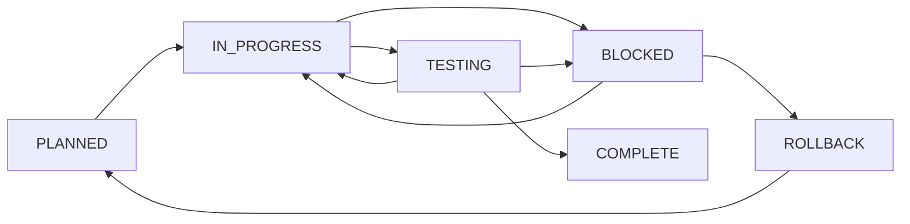

# Research Plan for Documentation Process Guide Items 5-9

**Date**: 2025-09-02  
**Purpose**: Research and propose solutions for remaining Documentation Process Guide improvements  
**Current Version**: v1.4.2  
**Target Version**: v1.5.0  
**Status**: 🔬 RESEARCH PHASE  

## Executive Summary

This research plan outlines solutions for the 5 remaining items (5-9) from the Documentation Process Guide v1.4 Improvements Plan. Items 1-4 are complete (✅ marked in improvements plan). Items 5-9 remain pending. Although some work has been done on Item 5 (README.md template added to guide), it is NOT marked complete in the improvements plan and needs formal completion.

## Reference Documents
1. **Main Guide**: `docs/proposal/DOCUMENTATION_PROCESS_GUIDE.md` (v1.4.2)
2. **Improvements Plan**: `docs/proposal/DOCUMENTATION_GUIDE_V1.4_IMPROVEMENTS_PLAN.md`
3. **Workflow Guide**: `docs/documentation_process_guide/COMPREHENSIVE_WORKFLOW_GUIDE.md`

---

## Item 5: Post-Implementation Fixes Index

### Problem Statement
No centralized overview of fixes without opening multiple folders. Teams cannot quickly assess:
- Total number of post-implementation issues
- Severity distribution
- Fix patterns and trends
- Current status of fixes

### Current State Analysis
- README.md template was added to Documentation Process Guide v1.4.2
- Template exists in guide but not consistently applied
- Item #5 NOT marked complete (no ✅) in improvements plan
- Many existing features lack README.md indexes

### Proposed Solution

#### Complete Implementation
```markdown
## Post-Implementation Fixes Index Requirements

### Mandatory README.md Structure
post-implementation-fixes/README.md MUST contain:

1. **Header Statistics**
   - Total Fixes: X
   - Last Updated: YYYY-MM-DD
   - Severity Breakdown: 🔴 Critical: 0 | 🟠 High: 1 | 🟡 Medium: 2 | 🟢 Low: 1

2. **Severity Sections** (All 4 required even if empty)
   - Critical Issues table
   - High Priority table  
   - Medium Priority table
   - Low Priority table

3. **Required Columns**
   - Date
   - Issue (brief description)
   - Environment (Prod/Staging/Dev)
   - Metrics (specific measurements)
   - Status (✅ Fixed | 🚧 In Progress | ⚠️ Blocked)
   - Link (to detailed fix report)

4. **Analysis Sections**
   - Fix Patterns & Lessons Learned
   - Statistics (time to fix, environment distribution, root causes)

### Enforcement
- Add to ACTIVE RULES as mandatory requirement
- CI check for README.md existence
- Template validation in PR checklist
```

#### Implementation Steps
1. Audit all existing features for missing README.md files
2. Create README.md for all features with post-implementation fixes
3. Validate all README.md files match template structure
4. Add CI/CD check for README.md in post-implementation-fixes/
5. Update ACTIVE RULES to make explicitly mandatory
6. Mark Item #5 as COMPLETE in improvements plan

#### Success Criteria
- [ ] 100% of features with fixes have README.md
- [ ] All README.md files follow template exactly
- [ ] CI check prevents missing README.md
- [ ] Item #5 marked ✅ in improvements plan

---

## Item 6: Meta-Documentation Handling

### Problem Statement
Documentation about the documentation process is currently mixed with feature documentation, causing:
- Confusion about where to find process updates
- Feature directories cluttered with meta-docs
- Difficulty tracking guide evolution

### Current State Analysis
- Documentation guide updates live in feature directories
- Process improvements mixed with implementation reports
- No clear separation between "what" and "how to document"

### Proposed Solution

#### Directory Structure
```
/docs/
├── proposal/                     # Feature documentation (existing)
│   └── <feature_slug>/          # Individual features
├── meta/                        # NEW - Documentation about documentation
│   ├── guide-updates/          # Version history and changes
│   │   ├── v1.4.0-changelog.md
│   │   ├── v1.4.1-changelog.md
│   │   └── v1.4.2-changelog.md
│   ├── compliance-checks/      # Validation and audits
│   │   ├── 2025-09-audit.md
│   │   └── compliance-checklist.md
│   ├── process-improvements/   # Proposals and research
│   │   ├── RESEARCH_PLAN_ITEMS_6-9.md
│   │   └── severity-definitions-proposal.md
│   └── training/              # How-to guides and examples
│       ├── example-implementation-report.md
│       └── severity-classification-guide.md
└── documentation_process_guide/ # Current location (to be moved)
```

#### Implementation Steps
1. Create `/docs/meta/` directory structure
2. Move existing meta-documentation:
   - `DOCUMENTATION_PROCESS_GUIDE.md` → `/docs/meta/guide-updates/`
   - `DOCUMENTATION_GUIDE_V1.4_IMPROVEMENTS_PLAN.md` → `/docs/meta/process-improvements/`
   - All proposals → `/docs/meta/process-improvements/`
3. Update all references in feature documentation
4. Add to ACTIVE RULES: "Meta-documentation goes in /docs/meta/, never in feature directories"

#### Success Criteria
- [ ] Zero meta-docs in feature directories
- [ ] All process docs findable in /docs/meta/
- [ ] Clear separation of concerns

---

## Item 7: LLM Safety Guardrails

### Problem Statement
LLMs lack clear stop conditions and forbidden actions, leading to:
- Infinite loops on failing tests
- Modifications outside feature boundaries
- Confusion when encountering contradictions
- Inappropriate status transitions

### Current State Analysis
- No formal STOP conditions defined
- Forbidden actions scattered throughout guide
- LLMs must infer boundaries from context
- No escalation path for stuck situations

### Proposed Solution

#### Add to ACTIVE RULES (New Rule #6)
```markdown
6) LLM Safety Guardrails
- **STOP Conditions** (Must halt and request human help):
  - Same test fails 3+ times
  - Conflicting instructions detected
  - About to modify files outside feature directory
  - Status: COMPLETE but asked to modify implementation-details/
  - Severity classification ambiguous (>2 possible levels)
  - Creating files but unsure of location
  
- **FORBIDDEN Actions** (Never do without explicit permission):
  - Change Status from COMPLETE to IN PROGRESS
  - Modify files outside current feature directory
  - Delete or rename completed documentation
  - Mix meta-documentation with feature docs
  - Apply deprecated rules from DEPRECATED section
  - Create new top-level directories
  
- **ESCALATION Protocol**:
  - After 3 failed attempts: Stop and document issue
  - Tag @maintainer in comments
  - Create BLOCKED status report
  - Wait for human intervention
```

#### Implementation Steps
1. Add Rule #6 to ACTIVE RULES section
2. Create escalation template in bug fix template
3. Add BLOCKED status to implementation statuses
4. Create examples of when to stop vs continue
5. Test with actual LLM sessions

#### Success Criteria
- [ ] Zero infinite loops in LLM sessions
- [ ] Clear boundaries respected
- [ ] Escalation path documented and used
- [ ] Reduced inappropriate modifications

---

## Item 8: Implementation Status Stages

### Problem Statement
Current status options (IN PROGRESS, COMPLETE) don't reflect real workflow:
- No status for planning phase
- No status for testing/validation
- No way to indicate blocked work
- No rollback status for failed implementations

### Current State Analysis
- Only 2 status values currently documented
- Workflow guide shows 6 proposed statuses
- No transition rules defined
- Status changes are irreversible (can't go back from COMPLETE)

### Proposed Solution

#### Expanded Status Values
```markdown
## Implementation Status Values

### Core Statuses (Required)
- 📝 **PLANNED**: Plan exists, implementation not started
- 🚧 **IN PROGRESS**: Actively implementing
- 🧪 **TESTING**: Implementation done, validating
- ✅ **COMPLETE**: All criteria met, phase boundary crossed
- ❌ **BLOCKED**: Cannot proceed without human intervention
- 🔄 **ROLLBACK**: Implementation failed, reverting changes

### Transition Rules


### Transition Requirements
- PLANNED → IN PROGRESS: First code commit
- IN PROGRESS → TESTING: All implementation tasks done
- TESTING → COMPLETE: All tests pass, criteria met
- Any → BLOCKED: Document blocker reason
- BLOCKED → ROLLBACK: Decision to abandon approach
- COMPLETE → (nowhere): Irreversible boundary
```

#### Implementation Steps
1. Update main report template with all 6 statuses
2. Add transition rules to ACTIVE RULES
3. Create examples for each transition
4. Update TodoWrite integration to use new statuses
5. Add status history tracking requirement

#### Success Criteria
- [ ] All 6 statuses documented and used
- [ ] Clear transition rules enforced
- [ ] Status history tracked in reports
- [ ] No invalid transitions

---

## Item 9: Patches Directory Management

### Problem Statement
Patches directory exists but lacks:
- Clear usage guidelines
- Naming conventions
- Documentation requirements
- Relationship to main documentation

### Current State Analysis
- `patches/` directory mentioned but not explained
- No examples of when to use patches
- No naming convention defined
- Unclear if patches are for code or documentation

### Proposed Solution

#### Patches Directory Structure & Rules
```markdown
## Patches Directory Management

### Directory Structure
```
patches/
├── implementation/           # During active implementation
│   ├── 2025-09-02-001-initial-structure.patch
│   ├── 2025-09-02-002-api-endpoints.patch
│   └── 2025-09-02-003-validation-logic.patch
└── post-impl/               # After Status: COMPLETE
    ├── 2025-09-03-fix-memory-leak.patch
    └── 2025-09-03-fix-api-timeout.patch
```

### Naming Convention
`YYYY-MM-DD-###-description.patch`
- Date: Creation date
- ###: Sequential number (001, 002, etc.)
- Description: Kebab-case summary

### When to Use Patches
✅ USE patches for:
- Reviewing large changes before applying
- Sharing code changes for review
- Documenting exact changes made
- Creating rollback points
- Archiving significant fixes

❌ DON'T use patches for:
- Single-line changes
- Documentation updates
- Configuration changes
- Test data

### Documentation Requirements
Each patch MUST have:
1. Corresponding entry in implementation report or fix report
2. Description of what it changes
3. Why the change was needed
4. How to apply: `git apply patches/implementation/[patch-name]`
5. How to revert: `git apply -R patches/implementation/[patch-name]`

### Patch Creation Commands
```bash
# Create patch from staged changes
git diff --cached > patches/implementation/2025-09-02-001-feature.patch

# Create patch from last commit
git format-patch -1 HEAD -o patches/implementation/

# Apply patch
git apply patches/implementation/2025-09-02-001-feature.patch

# Check if patch applies cleanly
git apply --check patches/implementation/2025-09-02-001-feature.patch
```
```

#### Implementation Steps
1. Add Patches section to ACTIVE RULES
2. Create example patches in a reference feature
3. Document patch workflow in templates
4. Add patch checklist to implementation report
5. Create patch validation script

#### Success Criteria
- [ ] Clear guidelines for patch usage
- [ ] Consistent naming across all patches
- [ ] Patches properly documented
- [ ] Easy to apply and revert

---

## Research Timeline

### Week 1: Research & Design
- Day 1-2: Deep dive into each problem
- Day 3-4: Design detailed solutions
- Day 5: Create proposals for each item

### Week 2: Implementation
- Day 1: Item 5 (Post-Implementation Fixes Index) - Complete and mark ✅
- Day 2: Item 6 (Meta-Documentation)
- Day 3: Item 7 (LLM Guardrails)
- Day 4: Item 8 (Status Stages)
- Day 5: Item 9 (Patches)

### Week 3: Validation
- Test with real features
- Gather feedback
- Refine solutions
- Update documentation

### Week 4: Rollout
- Update DOCUMENTATION_PROCESS_GUIDE.md to v1.5.0
- Migrate existing documentation
- Training and communication
- Monitor adoption

---

## Risk Analysis

| Risk | Impact | Likelihood | Mitigation |
|------|--------|------------|------------|
| Breaking existing workflows | High | Medium | Gradual rollout, clear migration path |
| LLM confusion with new rules | Medium | Low | Extensive examples, clear ACTIVE RULES |
| Meta-docs not moved | Low | Medium | Automated migration script |
| Status proliferation | Medium | Low | Limit to 6 essential statuses |
| Patches unused | Low | High | Make optional, provide clear value |

---

## Success Metrics

### Quantitative
- Stability rating increases from 8/10 to 9/10
- Zero meta-docs in feature directories
- 100% of new features use expanded statuses
- LLM success rate improves by 25%

### Qualitative
- Clearer separation of concerns
- Reduced confusion about where to document
- Better tracking of implementation progress
- Safer LLM operations

---

## Dependencies

1. **Item 5 Completion**: Should formally complete Post-Implementation Fixes Index first
2. **Team Buy-in**: Especially for meta-documentation location change
3. **LLM Testing**: Need to validate guardrails with actual AI agents
4. **Migration Tools**: Scripts to move existing documentation

---

## Open Questions

1. Should meta-documentation version control be separate from main codebase?
2. How to handle LLM guardrails for different AI models (GPT, Claude, etc.)?
3. Should BLOCKED status have sub-categories (blocked-technical, blocked-decision, etc.)?
4. Should patches be required or remain optional?
5. How to enforce patches directory rules in CI/CD?

---

## Recommendations

### Priority Order
1. **Item 5 (Post-Implementation Fixes Index)**: Already partially done, easy to complete
2. **Item 7 (LLM Guardrails)**: Most critical for safety
3. **Item 8 (Status Stages)**: Improves workflow clarity
4. **Item 6 (Meta-Documentation)**: Organizational improvement
5. **Item 9 (Patches)**: Nice-to-have, make optional

### Quick Wins
- Complete Item 5 by marking ✅ in improvements plan (template already exists)
- Add LLM guardrails immediately (high impact, low effort)
- Create /docs/meta/ structure (easy reorganization)
- Document 6 status values (already informally used)

### Consider Deferring
- Complex patch management rules (keep simple initially)
- Automated compliance checking (manual initially)

---

## Next Steps

1. **Review & Approve**: Get stakeholder feedback on proposals
2. **Create Detailed Proposals**: One proposal document per item
3. **Prototype**: Test solutions with sample feature
4. **Implement**: Update Documentation Process Guide to v1.5.0
5. **Migrate**: Move existing documentation to new structure
6. **Monitor**: Track adoption and gather feedback

---

## Conclusion

Completing Items 5-9 will bring the Documentation Process Guide to its target 9/10 stability rating. Item 5 should be completed first as the work is mostly done (template exists in v1.4.2), it just needs formal completion and enforcement. The remaining items (6-9) are new implementations that will require more effort.

The proposed solutions are practical, implementable within 4 weeks, and address real pain points in the current system. Priority should be given to completing Item 5, then LLM safety guardrails and status stages as they have the most immediate impact on daily workflows.

The meta-documentation handling and patches management, while important, can be implemented more gradually. All solutions maintain backward compatibility while providing clear migration paths.

---

*This research plan provides actionable solutions for completing Items 5-9 of the Documentation Process Guide v1.4 Improvements Plan. Note that Items 1-4 are marked complete (✅), while Items 5-9 remain pending. Implementation of all 5 remaining items will result in v1.5.0 with significantly improved clarity, safety, and usability.*