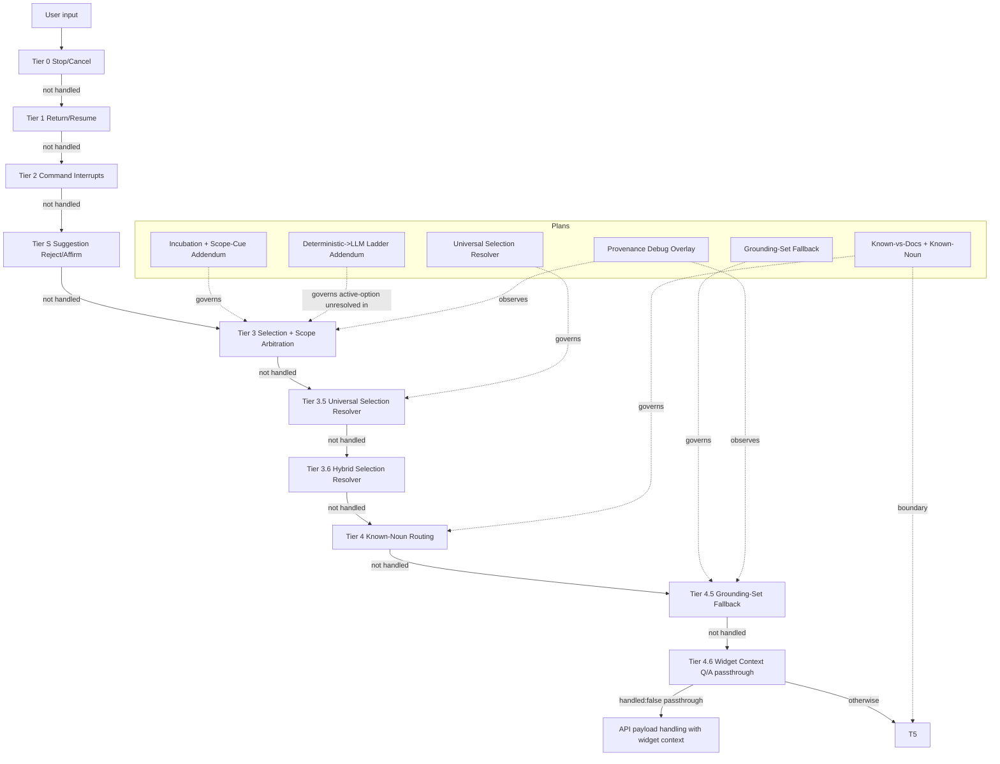

# Chat Routing and Selection Plans Illustrated

**Status:** Reference map  
**Purpose:** Show how the active plan files fit together in one routing model.

## Accuracy Notes

- This file is a visual guide, not behavioral authority.
- Some plans describe **implemented baseline behavior** and others describe **incubation/flagged target behavior**.
- Where they differ, this file marks the difference explicitly instead of collapsing them.

## 1) Plan-to-Responsibility Map (Hierarchy View)

```text
docs/
└── proposal/
    └── chat-navigation/
        └── plan/
            └── panels/
                └── chat/
                    └── meta/
                        ├── Selection family
                        │   ├── selection-intent-arbitration-incubation-plan.md [MAIN]
                        │   ├── selection-intent-arbitration-scope-cues-addendum-plan.md [ADDENDUM]
                        │   └── universal-selection-resolver-plan.md [IMPLEMENTATION CONTRACT]
                        ├── Fallback family
                        │   └── grounding-set-fallback-plan.md
                        ├── Deterministic->LLM ladder family
                        │   ├── deterministic-llm-arbitration-fallback-plan.md [GLOBAL POLICY]
                        │   └── deterministic-llm-ladder-enforcement-addendum-plan.md [ACTIVE-OPTION ENFORCEMENT]
                        ├── Debug/observability family
                        │   └── chat-provenance-debug-overlay.md [DEV-ONLY OVERLAY]
                        ├── Routing order authority
                        │   └── routing-order-priority-plan.md [ORDER LOCK]
                        └── Known-vs-doc boundary family
                            ├── known-vs-doc-routing-general-plan.md [CANONICAL REFERENCE]
                            └── known-noun-command-routing-plan.md
```

Notes:
- Detailed selection lineage is intentionally centralized in `## 1a` to avoid duplication.
- Status details remain in the source plan files and are summarized here only where needed for orientation.

## 1a) Selection-Intent Plan Lineage (Main -> Addenda -> Reports)

```text
selection-intent-arbitration-incubation-plan.md                    [MAIN]
│
├── selection-intent-arbitration-widget-first-fix-plan.md
│   └── reports/2026-02-07-selection-intent-arbitration-widget-first-fix-report.md
│
├── selection-intent-arbitration-scope-cues-addendum-plan.md
│   ├── scope-cue-normalization-chat-scope-plan.md
│   │   └── reports/2026-02-07-scope-cue-normalization-chat-scope-report.md
│   │
│   └── reports/2026-02-07-scope-cue-recovery-memory-report.md
│
└── reports/2026-02-06-selection-intent-arbitration-implementation-report.md
```

| Artifact | Parent/Lineage |
|---|---|
| `selection-intent-arbitration-incubation-plan.md` | Main plan |
| `selection-intent-arbitration-widget-first-fix-plan.md` | Derived from main plan |
| `selection-intent-arbitration-scope-cues-addendum-plan.md` | Derived from main plan |
| `scope-cue-normalization-chat-scope-plan.md` | Derived from scope-cues addendum |
| `reports/2026-02-06-selection-intent-arbitration-implementation-report.md` | Report for main incubation rollout |
| `reports/2026-02-07-selection-intent-arbitration-widget-first-fix-report.md` | Report for widget-first fix plan |
| `reports/2026-02-07-scope-cue-normalization-chat-scope-report.md` | Report for scope-cue normalization plan |
| `reports/2026-02-07-scope-cue-recovery-memory-report.md` | Follow-up report under scope-cues addendum |

### 1b) Report Attribution Truth (Important)

- There is currently **no dedicated implementation report explicitly tied to**:
  - `universal-selection-resolver-plan.md`
- There is currently **no single dedicated implementation report explicitly tied to**:
  - `routing-order-priority-plan.md` (even though `INDEX.md` marks it implemented)
- Current implementation reports are published under the selection-intent arbitration lineage:
  - `selection-intent-arbitration-incubation-plan.md`
  - `selection-intent-arbitration-scope-cues-addendum-plan.md`
  - follow-up reports linked to those tracks
- Practical implication:
  - Treat universal-resolver implementation status as **inferred from related reports + code**, not as a direct one-to-one plan report.
  - Treat routing-order implementation status as **inferred from distributed routing reports + code**, unless/until a dedicated report is published.

### 1c) Governance: Normative Source (Per Branch)

| Branch | Normative source | Addenda / implementation track |
|---|---|---|
| Selection intent arbitration | `selection-intent-arbitration-incubation-plan.md` | `selection-intent-arbitration-widget-first-fix-plan.md`, `selection-intent-arbitration-scope-cues-addendum-plan.md` |
| Scope-cue chat behavior | `selection-intent-arbitration-scope-cues-addendum-plan.md` | `scope-cue-normalization-chat-scope-plan.md`, recovery-memory follow-up reports |
| Universal resolver integration | `universal-selection-resolver-plan.md` | Uses arbitration lineage evidence until direct report exists |
| Routing tier precedence | `routing-order-priority-plan.md` | Enforced by dispatcher/chat-routing ordering + blocker tests |

Rule:
- If files conflict, resolve by branch normative source first, then addendum, then report.
- Tier ordering conflicts are resolved by `routing-order-priority-plan.md` before branch-local policy interpretation.

### 1d) Blocker Test Entry Points (Selection Branch)

- `__tests__/unit/chat/selection-intent-arbitration.test.ts`
- `__tests__/integration/chat/selection-intent-arbitration-race.test.ts`
- `__tests__/integration/chat/selection-intent-arbitration-dispatcher.test.ts`

Merge expectation:
- Routing changes under selection/arbitration are not complete until these suites pass and expected scenarios are updated.

### 1e) Change Gate (Required for Selection Routing PRs)

1. Update the normative plan/addendum text for the changed rule.
2. Update or add blocker tests covering the changed flow.
3. Add/append an implementation report under `meta/reports/` with date and evidence.
4. Update this illustration lineage/status section if parent-child/report mapping changed.

### 1f) Status + Last Verified Snapshot

| Branch artifact | Status signal | Last verified |
|---|---|---|
| `selection-intent-arbitration-incubation-plan.md` | Incubation draft + active implementation lineage | 2026-02-07 |
| `selection-intent-arbitration-widget-first-fix-plan.md` | Implemented via report chain | 2026-02-07 |
| `selection-intent-arbitration-scope-cues-addendum-plan.md` | Addendum draft + implementation reports present | 2026-02-07 |
| `universal-selection-resolver-plan.md` | Draft, no dedicated one-to-one implementation report | 2026-02-08 |
| `deterministic-llm-arbitration-fallback-plan.md` | Global deterministic->LLM->safe-fallback policy | 2026-02-11 |
| `deterministic-llm-ladder-enforcement-addendum-plan.md` | Active-clarification enforcement + Phase C auto-execute gates | 2026-02-11 |
| `chat-provenance-debug-overlay.md` | Dev-only observability plan (non-behavioral) | 2026-02-11 |

### 1g) Deterministic->LLM Ladder Lineage (Main -> Addendum)

```text
deterministic-llm-arbitration-fallback-plan.md                 [GLOBAL POLICY]
│
└── deterministic-llm-ladder-enforcement-addendum-plan.md      [ACTIVE-OPTION ENFORCEMENT]
    ├── Phase B: unified unresolved hook + loop-guard continuity
    └── Phase C: gated LLM auto-execute (flag + confidence + allowlist)
```

Important scope note:
- The addendum is scoped to active-option clarification flows (`chat-routing.ts`, Tier 1b.3 family).
- It does not redefine cross-corpus Tier 2b behavior by itself.

## 2) Canonical Routing Illustration



## 3) Selection Arbitration Illustration

```mermaid
flowchart TD
  S0[Selection-like input?] -->|No| N0[Continue normal routing]
  S0 -->|Yes| S1[Explicit scope cue present?]
  S1 -->|Yes: chat| C1[Restore chat context]
  S1 -->|Yes: widget| W1[Bind/switch widget latch]
  S1 -->|No| S2[Active executable context exists?]
  S2 -->|No| N0
  S2 -->|Yes| S3[Deterministic match]
  S3 -->|Unique| E1[Execute choice]
  S3 -->|No unique| A0[Ambiguity exception check]
  A0 -->|[Incubation mode] Pure ordinal + dual-source ambiguity| C3[Ask grounded source clarifier\nno LLM in this branch]
  A0 -->|Otherwise| S4[Constrained LLM on active candidates]
  S4 -->|select(choiceId)| E1
  S4 -->|need_more_info or fail| C2[Grounded clarifier/retry prompt]
```

## 3a) Resolver Mode Truth (Important)

- **Universal resolver plan mode:** chat context precedence when both executable contexts exist.
- **Incubation latch mode:** focused widget precedence for unspecific selection-like follow-ups while latched.
- **Ambiguity carve-out note:** direct clarifier for pure ordinal + dual-source ambiguity is incubation/scope-arbitration policy, not a universal rule for every resolver path.
- This is a real policy difference across plan files; do not silently merge them during implementation.

## 4) Latch Model (What "latched" means)

- Latch is the currently focused widget scope after real engagement.
- Engagement signals:
  - successful widget item selection
  - explicit widget scope cue
  - widget item click
- While latched:
  - unspecific selection follow-ups resolve against focused widget first
  - chat options are used only by explicit re-anchor (`back to options`, `from chat`)
- Latch exits on:
  - widget close
  - explicit target switch
  - stop/start-over
  - optional TTL expiry

### 4a) Critical Priority Rule (Implementer Contract)

This rule is mandatory when fixing routing:

1. **Explicit scope cue first**
   - `from chat`, `in chat`, `back to options`, `from earlier options` => chat scope.
   - Explicit scope cues override latch defaults.
2. **Explicit command second (override latch)**
   - `open panel e`, `open links panel d`, `open recent widget` => command path.
   - Even when Links Panel D is latched, explicit target-switch commands must execute as commands.
3. **Latch third (selection-like only)**
   - Latch applies only to selection-like follow-ups without explicit new target.
   - Examples: `second one`, `open summary144`, `the first one`.
4. **Then deterministic disambiguation / known-noun / fallback ladder**
   - Deterministic resolution first.
   - Constrained LLM only when deterministic cannot safely resolve.
   - Grounded clarifier when constrained LLM abstains/fails.

In short: **scope cue > explicit command > latch selection default**.

### 4b) Decision Table (Use Before Changing Code)

| Input shape | Latch active? | Expected winner | Notes |
|---|---:|---|---|
| `open panel e` | yes | explicit command | must switch panel, do not treat as latched item |
| `open links panel d` | yes | explicit command | direct known-noun/panel command path |
| `from chat` | yes/no | chat scope re-anchor | restore chat executable context |
| `open first one in chat` | yes/no | chat selection | single-turn chat-scoped execution |
| `second one` | yes | latch selection | widget-first selection default |
| `second one` | no, chat active | chat selection | active chat context applies |
| `what is summary144` | yes/no | question/doc path | bypass selection execution |

### 4c) Pre-Change Checklist (Do Not Skip)

- Confirm command-like input cannot be swallowed by stale-option re-show guards.
- Confirm explicit command paths are not blocked by question-intent heuristics for polite command variants.
- Confirm latch logic is only applied to selection-like inputs, not explicit target commands.
- Confirm explicit chat scope cues suspend latch and restore chat-active state consistently.
- Confirm fallback ladder remains safe: deterministic -> constrained LLM -> grounded clarifier.

### 4d) Minimum Regression Cases Required

1. Active latch + `open panel e` => opens Panel E (command override).
2. Active latch + `second one` => resolves inside latched widget.
3. Active latch + `open first one in chat` => resolves against chat options.
4. Active stale options + `can you open links panel pls` => panel disambiguation, not stale-option re-show.
5. `the second one` with active options => still works as selection (guard does not suppress valid ordinal flow).

## 5) Deterministic-First + LLM-Second Contract

1. Run deterministic normalization and strict matching first.
2. If unresolved and still selection-like, call constrained Gemini over bounded candidates only.
3. If LLM returns `need_more_info` or fails (timeout/429/error), show grounded safe clarifier.
4. Never execute from free-form LLM text. Execute only validated candidate ids.
5. Exception: in pure ordinal + dual-source ambiguity branch, ask grounded source clarifier directly (no LLM in that branch).

### 5a) Active-Option Ladder Enforcement (Addendum Snapshot)

For active clarification options, unresolved states (`0-match` or `multi-match no exact winner`) are handled by one unresolved hook:

1. Deterministic checks run first.
2. If not high-confidence, constrained LLM is called on bounded active options.
3. If LLM fails/abstains, safe clarifier remains in the same option set.
4. Loop-guard prevents repeated calls in one cycle; continuity preserves suggestion ordering.
5. Phase C only: auto-execute is allowed only when all explicit gates pass (feature flag, high confidence, reason allowlist).

## 5b) Cross-Corpus Boundary Note (Current Debugging Relevance)

- Inputs that route to Tier 2b (`cross-corpus`) are outside the active-option ladder addendum scope.
- A failure in docs-vs-notes disambiguation for a command-like utterance is a cross-corpus routing-order issue, not a Tier 1b.3 ladder bug.
- Use:
  - `known-vs-doc-routing-general-plan.md`
  - `routing-order-priority-plan.md`
  - `panel-aware-command-routing-plan.md`
  when triaging that class of failures.

## 6) State Invariants (Must hold)

- Never keep dual active executable contexts (`chat XOR widget`).
- When registering a new executable context, replace competing stale selection state:
  - `pendingOptions`
  - `activeOptionSetId`
  - `lastClarification`
  - `lastOptionsShown`
  - `clarificationSnapshot`
  - `widgetSelectionContext`
- `uiOnly` contexts may overlap but must not execute ordinals.

## 7) Conversation Illustration (Expected Behavior)

### A) Focused widget default
- User: `open links panel d`
- Assistant: `Opening Links Panel D.`
- User: `second one`
- Assistant: `Opening entry 2 in Links Panel D.`

### B) Explicit chat re-anchor
- User: `back to options`
- Assistant: `Okay, back to earlier options.`
- User: `second option`
- Assistant: executes from chat options, not widget latch.

### C) Long-tail phrasing
- User: `pls open the initial choice now`
- If deterministic fails: constrained LLM tries bounded candidates.
- If LLM fails/abstains: grounded retry (`Say first/second or tap an option.`).

### D) Command escape
- User: `open links panel d`
- Assistant: executes known-noun command path, not selection retry.

### E) Question bypass
- User: `what does summary144 mean?`
- Assistant: informational/doc path, not selection execution.

## 8) Quick Debug Checklist

- If wrong list executed:
  - verify context replacement invariant is applied when clarifier is registered.
- If ordinals ignored:
  - verify active executable context exists and resolver ran before lower tiers.
- If command trapped by retry:
  - verify command-escape guard in Tier 3.5 and Tier 4 path.
- If LLM 429 appears:
  - verify non-blocking fallback to grounded clarifier (no unsafe reroute).

## 9) Source of Truth

Use this file as a visual index only. Behavioral authority remains in:
- `routing-order-priority-plan.md`
- `selection-intent-arbitration-incubation-plan.md`
- `selection-intent-arbitration-scope-cues-addendum-plan.md`
- `universal-selection-resolver-plan.md`
- `deterministic-llm-arbitration-fallback-plan.md`
- `deterministic-llm-ladder-enforcement-addendum-plan.md`
- `grounding-set-fallback-plan.md`
- `known-vs-doc-routing-general-plan.md`
- `known-noun-command-routing-plan.md`

Observability-only (non-authoritative for behavior):
- `chat-provenance-debug-overlay.md`

## 10) Related References

- **[Known Command Vocabulary](known-command-vocabulary.md)** — Complete inventory of recognized input patterns: action verbs, canonicalizer prefixes, known noun targets, scope cues, question intent, affirmation/rejection/exit phrases, correction/follow-up/meta/reshow phrases, and panel token matching rules. Derived from source code; use when verifying what the routing system recognizes.
- **[Widget Registry Architecture Reference](widget-registry-architecture-reference.md)** — 3-layer architecture (registry → builder → routing integration) that provides structured widget data to Tier 4.5. Covers the provider/consumer split between `widget-registry-implementation-plan.md` (data provider) and `universal-selection-resolver-plan.md` (routing consumer), the Tier 3 / Tier 4.5 boundary rule, registry vs panel-intent-registry vs widget-state-store distinctions, and registration lifecycle.
